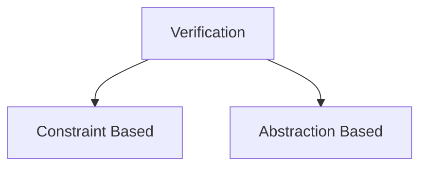
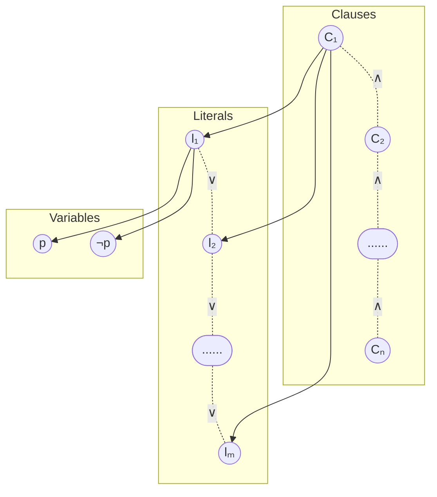
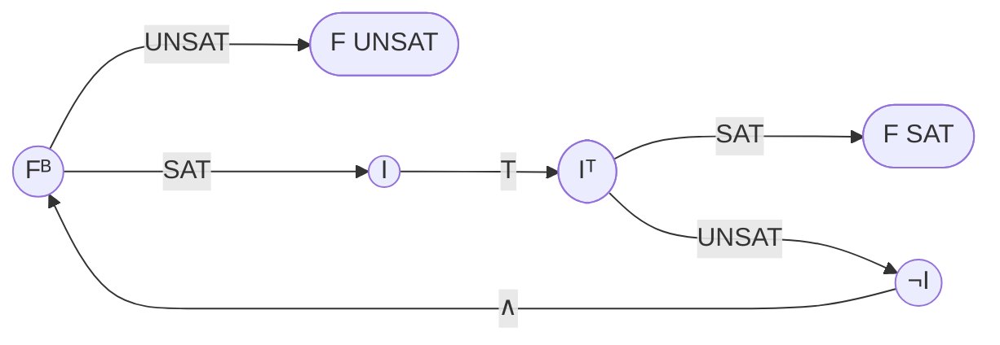

# Motivation

For any reasonably complex system, it is necessary to ensure that the system is acting as intended without any unpredictable behaviours that may end up compromising the system and/or the systems surrounding it. There are many safety critical systems whose malfunctioning can cause innumerable casualties and loss of life, thus for these systems we need to reliably prove that they have predictable outputs corresponding to determined inputs.

Formal Verification utilizes a lot of different mathematical tools to demonstrate the "correctness" of some system with respect to some desirable specification or property. The set of tools used for for Formal Verification is collectively known as Formal Methods and include such theories like logic, automata, type systems and formal languages. These can be used to check the behaviour of some system against a set of specifications in order to determine correctness of the system. Formal Verification can be imagined as a layer of abstraction on top of systems (both software and hardware) that provides some guarantees as to the functioning of these systems.

Below we will be building up to the application of Formal Methods to the field of Machine Learning in order to Verify Neural Networks.

<div style="background-color: #080D11;">
The following is an effort to condense the <a href="https://verifieddeeplearning.com/"> Introduction to Neural Network Verification</a> book in order to concisely summarize the material that is relevant to my research. 
</div>

# Introduction

## Background

One of the first demonstrations of the possibilities of verification came from Alan Turing's 1949 paper called ['Checking a large routine'](https://turingarchive.kings.cam.ac.uk/publications-lectures-and-talks-amtb/amt-b-8). In the paper the program for finding the factorial of a number was broken down into a simple sequential set of instructions that could either be either $True$ or $False$. The truth values for each of these assertions were then checked in order to prove that the program is a faithful implementation of the factorial mathematical function. This is known as proving the functional correctness of a program. Although this is the gold standard for demonstrating correctness, it is not possible to do so for Neural Networks as the tasks performed cannot be described mathematically. In a Neural Network we generally test for the following qualities:

- **Robustness**: This class of properties is violated when small perturbations to the inputs result in changes to the output. It also measures how well a model performs on new and unseen test data.
- **Safety**: This is a broad class of correctness properties that ensure that the program does not reach a 'bad' state. (e.g., a surgical robot should not be operating at 200mph)
- **Consistency**: This class of properties are violated only when the algorithms are not consistent with the real world. (e.g., tracking an object in free fall should be consistent with the laws of gravitation)

We will mostly be testing for Robustness, as that is the set of properties that are most widely tested for. It can also encapsulate the Safety and Consistency classes (as there is not well-defined boundary between them) if the specifications are designed accordingly.

<div style="background-color: #080D11;">
Alan Turning had also extensively thought about 'Networks that can Learn', which can be seen from his 1948 paper <a href=https://doi.org/10.1093/oso/9780198250791.003.0016>Intelligent Machinery</a> where he proposes Boolean NAND networks that can learn over time.
</div>

## Abstraction of Neural Network

We will not be dealing with the technicalities of the Neural Networks but rather used well-rounded mathematical abstractions that can be rigorously tested over. Since all Neural Networks can be though of as Directed Acyclic Graphs (DAGs), we will be treating them as such. More specifically they will be treated as dataflow graphs of operators over $\mathbb{R}$. The shape of these graphs will determine what specific architecture they belong to. Each node will perform some computation, whose dependencies are the edges. Thus, a neural network will be associated with some function:  
$$f: \mathbb{R}^{n} \rightarrow \mathbb{R}^{m}$$

For a Neural Network: $G = (V, E)$, we have: \
$V$: finite set of nodes \
$E \subseteq V \times V$: set of edges \
$V^{in} \subset V$ : input nodes \
$V^{o} \subset V$ : output nodes \
$n_v$ : total number of edges whose target is $v$ \
where, $n = |V^{in}|$ and $m = |V^{o}|$ for the network.

All neural networks are finite DAGs, there are classes of neural networks called Recurrent Neural Networks that have loops, but the number of iterations will depend on the size of the input. RNNs have self-loops that unroll based on the length of the input, which means that it reliably terminates. So while testing neural networks we will not test for loop termination and the explosion of possible program paths that comes with it.  

![[RNNs.drawio.png|500]]

For our purposes the following conditions must be met in a network:
- all nodes must be reachable from some input node
- every node can reach an output node
- fixed total ordering on edges $E$ and another one on nodes $V$.

Each node $v$ of the neural network is a function of the following form:
$$f_v: \mathbb{R}^{n_v} \rightarrow \mathbb{R}$$

Where each node takes in some vector, does some computation on it and return a single output number that is passed through an activation function (a non-linear function), for ease of analysis they are treated as belonging to two different nodes. Each of the elements of the vectors are the outputs of previous nodes. These relations can be recursively defined with the base case terminating at the input nodes. Therefore, for every non-input node $v \in V$, we have:  

![[node.png]]

Where each $(v_i, v)$ represents an edge connecting node $v_i$ to $v$. The ordering of these edges and nodes determines the inputs on the basis of which the computations will be done. Each node will have an $out(v)$ function which can be defined as follows:
$$out(v) = f_v(x_1, ..., x_{n_v})$$
where $x_i = out(v_i)$ for $i \in \{1, 2, ... , n_v\}$. This is the recursive definition wherein each input to the node $x_i$ can be defined as:
$$out(v) = f_v(out(v_1), out(v_2), ... , out(v_{n_v}))$$  
No sequence of operations are defined, only which nodes need what data to perform its computations. A more modified version of these graphs are known as **computation graphs**. $out(v_i)$ values can be computed in any topological ordering of graph nodes, as it needs to be ensured that all the inputs need to be computed before the target node itself.  


All vector computations need to be linear:
$$f(x) = \sum_{i=1}^{n} c_i x_i + b$$
or piece-wise linear:
$$  
f(x)\left\{\begin{array}{l}  
\sum_i c^{[1]}_i x_i + b^{[1]} \: , \: x \in S_1 \\  
\vdots \\  
\sum_i c^{[m]}_i x_i + b^{[m]} \: , \: x \in S_m  
\end{array}\right.  
$$
where $\cup_i S_i = \mathbb{R}^n$ and $\cap_i S_i = \varnothing$.   

<div style="background-color: #080D11;"> Note: Neural Networks are an instance of differential programs.</div>  


## Defining Specifications

We define a language that specifies some properties about the functioning of a neural net. This will enable us to later on make statements and verify them based on the specifying language.

**Specifications** are generally of the form:
$$
\begin{aligned}
\{precondition\} \\
r \leftarrow f(x) \\
\{postcondition\}
\end{aligned}
$$
where both preconditions and post-conditions are statements that specify some property that is adjacent to input and output respectively. Properties dictate the input-output behaviour of the network (and not the internals). Specifications help in quantifying some properties for accurate verification. Each specification can be thought of as being structured in the following way:  

$$\underbrace{for \ any \ inputs \ x, y, \dots \ that \ \dots}_{precondition} \ the \ neural \ network \ G \ produces \ \underbrace{output \ that \ \dots}_{pst condition}$$

Although every possible specification needed for complete verification cannot be made, multiple specifications can be combined together to test for stronger properties. Preconditions are generally predicates or Boolean functions defined over set of variables which act as inputs to the system, and  post condition is a Boolean predicate over the variables appearing in precondition ($x_i$) and assigned variables ($r_i$).  
For any values of $x_1, \dots , x_n$ that make the precondition true, let $r_1 = f(x_1)$, $r_2 = g(x_2) \dots$ , where $f(), g(), \dots$ are the computations on the input, then the post condition must also be *True*.  

$$
\begin{aligned}
\{precondition\} \\
r_1 \leftarrow f(x_1) \\
r_2 \leftarrow g(x_2) \\
\vdots \\
\{postcondition\}
\end{aligned}
$$  
If the post condition is **False**, then the correctness property is not true, i.e., the property does not hold.  

Consider: c is an actual greyscale image, each element of c is the intensity of a pixel $\in (0, 1)$; we can state the following specification about the brightness of c and its corresponding classification:  
$$
\begin{aligned}
\{|x-c| \le 0.1 \} \\
r_1 \leftarrow f(x) \\
r_2 \leftarrow f(c) \\
\{class(r_1) = class(r_2)\}
\end{aligned}
$$  
$r_1$ and  $r_2$ are vectors whose elements are probabilities for a belonging to a class with labels corresponding to the indexes. $class(r_1)$ and  $class(r_2)$ extract the indexes corresponding to the largest elements of the vectors $r_1$ and  $r_2$ respectively.  

<div style="background-color: #080D11;"> <b>Counterexamples:</b> Valuations of variables in precondition that falsifies the post condition.</div>




# Constraint-Based Verification

## Constraint-Based Satisfaction

A correctness property is taken and encoded as a set of constraints, solving which will help us to decide whether the property holds or not.

Let $fv(F)$ be the set of free variables appearing in the formula $F$. 

**Interpretation:** $I$ of $F$ is a map from variables present in $fv(F)$ to either $True$ or $False$. $I(F)$ denotes the formula where the variables have been replaced with their corresponding interpretations.  


***Example:***  
Let $F \triangleq (p \land q) \lnot r$, which means that $F$ is syntactically defined to be equal to the Boolean formula (as opposed to being semantically equivalent).  

$$
\begin{aligned}
\\ fv(F) = \{p, q, r\}
\\ I = \{ p \mapsto \text{True, } q \mapsto \text{False, } r \mapsto \text{True}
\} 
\\ I(F) \triangleq (\text{True} \land \text{False}) \lnot \text{True} 
\end{aligned}
$$

$eval(F)$: denotes the simplest form of $F$ we can get by evaluating repeatedly.  

$F$ is **satisfiable (SAT)** if there exists an $I$ s.t. $eval(I(F)) = True$, in which case, $I$ is the model of $F$: $I \models F$.   
$I \not \models F$ denotes $I$ isn't a model of $F$.  \
$I \not \models F$ if and only if $I \models \lnot F$.   \
$F$ is **unsatisfiable (UNSAT)** if $\forall I, \ eval(I(F)) = False$. 

**Validity:** If every interpretation $I$ is a model of $F$, then $F$ is valid.

Boolean satisfiability theories (SAT) can be generalised to more complex theories to include reals, vectors, strings, arrays, etc.; the problem of determining whether statements within these theories are true is known as **Satisfiability Modulo Theories** or simply **SMT**. We will be extensively using a first-order logic system called **Linear Real Arithmetic (LRA)** as it can represent a large class of neural networks and is decidable.  
In LRA, each propositional variable is replaced by a linear inequality of the form:
$$
\sum_{i=1}^{n} c_i x_i + b \le 0 \ \ \text{ OR } \ \ \sum_{i=1}^{n} c_i x_i + b \lt 0
$$  
where $c_i, b \in \mathbb{R}$.  

$$
(\ \underbrace{x+y \le 0}_{p} \ \land \ \underbrace{x-2y \lt 10}_{q} \ ) \ \lor \underbrace{x \ge 100}_{r}
$$  
An interpretation $I$ of $F$ is an assignment of every free variable to a real number.

## Encoding Neural Networks

We need to translate Neural Networks into a formula in LRA such that we can use SMT Solvers (specialised software that tests satisfiability for SMT problems).  

$f_v$: Function in node. \
$I$: Model. \
$F_v$: Encoding for node. \
$R_g$: Relational mapping for neural network.

<div style="background-color: #080D11;">Generally Variables with a subscript G refers to the overall neural network as a graph and those with a subscript v refers to individual nodes or a collection of nodes.</div>

Whole Network can be defined as a binary relation:  
$$
R_G = \{ (a, b) | \ a \in \mathbb{R}^{n},\ b = f_G(a) \}
$$  
$R_v$, $f_v$ define the same for a single node $v$ in $G$ network. 

**For a single neuron with corresponding function $f_v: \mathbb{R} → \mathbb{R}$, both can be defined as:**

$$
f_v(x) = x + 1 \ \ \text{and} \ \ R_v = \{ (a, a+1)| \ a \in \mathbb{R} \}
$$
Thus the encoding for a node with one input is as follows
$$
F_v \triangleq v^o = v^{in, 1} + 1
$$
Models of $F_v$ will be of the form $\{ v^{in,1} \mapsto a, v^o \mapsto a +1 \}$ and have one-to-one correspondence with the elements of $R_v$.

**For two inputs:**
The formula for the encoding of a node with the function $f(x) = x_1 + 1.5x_2$ can be represented as  

$$F_v \triangleq v^o = v^{in, 1} + 1.5 v^{in, 2}$$  

**Generalizing encoding for any single node**:

Formalizing the operation $f_v$ of some node $v$. We assume that the function $f_v : \mathbb{R}^{n_v} \rightarrow \mathbb{R}$ is piecewise linear, i.e., of the form
$$
f(x)= \begin{cases}\sum_j c_j^1 x_j+b & \text { if } S_1 \\
\vdots & \\
\sum_j c_j^l x_j+b & \text { if } S_l\end{cases}
$$  

where $j$ ranges from $1$ to $n_v$. This generalizes representations to allow any one linear operation corresponding to some predetermined condition $S_i$. Each $S_i$ is defined as a formula in LRA over the elements of $x$. Thus, the encoding for the single node can be written as:
$$
F_v \triangleq \bigwedge_{i=1}^l\left[S_i \Rightarrow\left(v^{\mathrm{o}}=\sum_{j=1}^{n_v} c_j^i \cdot v^{\mathrm{in}, j}+b^i\right)\right]
$$  
if statement $S_i$ is $True$, then $v^o$ is equal to the $i^{th}$ equality. The statements are combined together using a conjunction over all possible inputs ($v^{in, j}$) to the node. Each clause joined using the conjunction is in $\text{condition} \implies \text{assignment}$ form providing the functionality of an **if** statement. So the general way to read this condensed statement is:
$$
\text{if } S_1 \text{ then } \dots \text{ AND if } S_2 \text{ then } \dots
$$  
**Example (ReLU):**

$$
relu(x)=\left\{\begin{array}{l}
x & \text{if} & x>0 \\
o & \text{if} & x \le 0
\end{array}\right.
$$  
The encoding for a simple ReLU function will be:

$$
F_v \triangleq(\underbrace{v^{\mathrm{in}, 1}>0}_{x>0} \Rightarrow v^0=v^{\mathrm{in}, 1}) \wedge(\underbrace{v^{\mathrm{in}, 1} \leqslant 0}_{x \leqslant 0} \Rightarrow v^0=0)
$$  
In order to ensure that we are making accurate representations of the actual system that we are modelling, we have to ensure that two qualities are always guaranteed for the encodings: **Soundness** & **Completeness**.  

**Soundness** - This is to make sure that our model does not miss any behaviour of $f_v$. Let $(\vec{a}, b) \in \mathbb{R}$  

$$
I = \{ v^{in, 1} \mapsto a_1, \dots, v^{in, n} \mapsto a_n, v^o \mapsto b\}
$$  
for any given tuple of $\vec{a}$ and $b$ which is an element of $R_v$, $I$ is a model of $F_v$ : $I \models F_v$. Soundness is the property of only being able to prove "true" things, any analysis about the system that is proven to be true, will be true.

**Completeness** - Any model of $F_v$ maps to a behaviour of $f_v$, so if for a model of $F_v$:  

$$
I = \{ v^{in, 1} \mapsto a_1, \dots, v^{in, n} \mapsto a_n, v^o \mapsto b\}
$$  
then $(\vec{a}, b) \in \mathbb{R}$. Completeness is the property of being able to prove all true things that can possibly exist in the system. This property can be used to determine *counterexamples* for any given model.

So far we have seen how to encode a singular node in a larger network. But to encode an entire Neural Net, we need to have the following structure:


### Encoding the nodes:
for all non-input nodes we have:

$$
F_V \triangleq \bigwedge_{v \in V/V_{in}} F_v
$$  
Since the input nodes do not perform any operations, we are excluding them from the set using $V/V_{in}$.
$$
\text{the output of } v_1 \text{ is } \dots \text{ AND the output of } v_2 \text{ is } \dots
$$  
### Encoding the edges:
For some node $v \in V/V_{in}$ there exists a total ordering of edges: $(v_1, v), (v_2, v), \dots$
The total ordering tells us which edge feeds into which corresponding input index of the node.

$$
F_{o \rightarrow v} \triangleq \bigwedge_{i=1}^n v^{in, i} = v^o
$$  
$$
F_E = \bigwedge_{v \in V/V_{in}} F_{o \rightarrow v}
$$  
As per the total ordering of the input edges, $F_{o \rightarrow v}$ determines that the output of the $i^{th}$ node from the previous layer will become the $i^{th}$ input of the present node. The $v$'s present in the below diagram are the sequentially ordered nodes of the previous layer.

![[edgeEncoding.jpg]]

More concretely:  

$$
v^{[o]}_i \implies v^{[in, i]}
$$  

The entire network can be represented as a conjunction of the edges and nodes:
$$
F_G \triangleq F_V \ \land \ F_E
$$  
Assuming that we have ordered input nodes in $V_{in}$ 
Let $(a, b) \in R_G$ and let

$$
I = \underbrace{\{ v^o_1 \mapsto a_1, \dots , v^o_n \mapsto a_n \}}_{\text{input}} \cup \underbrace{\{ v^o_{n+1} \mapsto a_{n+1}, \dots, v^o_{n+m} \mapsto a_{n+m}\}}_{\text{output}}
$$  
Then there exists $I^\prime$ such that $I \cup I^\prime \models F_G$. 

<div style="background-color: #080D11;">Note: Size of encoding is linear in the size of the Neural Network</div>

**Example:**  

The functions corresponding to nodes $v_3$ and $v_4$ are as follows:  
$$f_{v_3}(x) = 2x_1 + x_2  \text{and} f_{v_4}(x) = \text{relu}(x)$$  
The formulations for each of the corresponding nodes will be:  
 
$$\text{Node } v_3 : \ F_{v_3} \triangleq v^o_3 = 2 v^{in, 1}_3 + v^{in, 1}_3 $$  
$$\text{Node } v_4 : \ F_{v_4} \triangleq (v^{in, 1}_4 > 0 \implies v^o_4 = v^{in, 1}_4) \land (v^{in, 1}_4 \le 0 \implies v^o_4 = 0)$$  
$$
\begin{aligned}
F_{o \rightarrow v_3} \triangleq (v^{in, 1}_3 = v^o_1) \land (v^{in, 2}_3 = v^o_2)
\\
F_{o \rightarrow v_4} \triangleq (v^{in, 1}_4 = v^o_3)
\end{aligned}
$$  
Encoding of $G$ :   $F_G \triangleq \underbrace{F_{v_3} \land F_{v_4}}_{F_V} \land \underbrace{F_{o \rightarrow v_3} \land F_{o \rightarrow v_4}}_{F_E}$  
So far we have been considering the linear operations that form the weights and biases for the nodes in a neural network, however, there are also non-linearities that are present.

*How to deal with non-linear activations?*

We can create representations of non-linear activation functions by over-approximation of said functions. Over-approximation is the partitioning of the function into different input domains and binding the outputs corresponding to each of these input domains to some defined output domain. For example; we can make an over-approximation for the Sigmoid ($\sigma (x)$) function by diving the function into appropriate intervals that roughly corresponds to its overall behaviour, i.e., anything less than a certain threshold will give us a 0, anything more than a certain threshold will give us 1 and any input values in between them will give us a value of roughly 0.5.

$$
\begin{aligned}
F_v \triangleq \ \ \ \ (v^{in, 1} \le -1 \implies 0 \le v^o \le 0.26) \land \\
 (-1 < v^{in, 1} \le 0 \implies 0.26 < v^o \le 0.5) \land \\
 (0 < v^{in, 1} \le 1 \implies 0.5 < v^o \le 0.73) \land \\
 (v^{in, 1} > 1 \implies 0.73 < v^o \le 1)
\end{aligned}
$$  
The above can be generalized to any monotonically increasing or decreasing function $f_v$ (which is all activation functions). Assume $f_v$ is monotonically increasing, sample a sequence of real values $c_1 < \dots < c_n$  

$$
\begin{aligned}
F_v \ \ \triangleq \ \ \ \ \ \ \ \ \ \ \ \ \ \ \  (v^{in, 1} \le c_1 \implies lb < v^o \le f(c_2) ) \\
\land (c_1 < v^{in, 1} \le c_2 \implies f_v(c_1) < v^o \le f(c_2)) \\
\vdots \\
\land (c_n < v^{in, 1} \implies f_v(c_n) < v^o \le ub \\
\end{aligned}
$$  
where $lb$ and $ub$ are the *lower bound and *upper bound* respectively. A point to note in the case of over-approximations are that they will give us soundness, but not completeness. Completeness essentially means that our encoding can find **counterexamples**, which we are abandoning in this case. Soundness means being able to prove correctness properties using an encoding, which is of highest priority for our models.

### A Concrete Example for checking Robustness


$$
f_G : \mathbb{R} \rightarrow \mathbb{R}^2
$$  
Where the output vectors in $\mathbb{R}^2$ correspond to:

$$
\begin{bmatrix}
\\
p(\text{cat}) \\
\\
p(\text{dog})\\
\\
\end{bmatrix}
$$  
Let the specification for this be:

$$
\begin{aligned}
\{ |x - c | \le 0.1\} \\
r \leftarrow f_G(x) \\
\{ r_1 > r_2 \}
\end{aligned}
$$  
where $c$ is the original image and $x$ is the perturbed image. The formula generated to check this statement is called a **Verification Condition** (VC), which if valid then ensures that the correctness property holds.

$$
(\underbrace{\text{precondtion}}_{p} \land \underbrace{\text{neural network}}_{G}) \implies \underbrace{\text{postcondition}}_{q}
$$  
inputs: $\{v_1, \dots, v_n\}$                    outputs: $\{v_{n+1}, v_{n+2}\}$                    Neural Network: $F_G$

$$
\underbrace{\left(\bigwedge^n_{i = 1} |x_i - c_i| \le 0.1 \right)}_{\text{precondition}} \land \underbrace{F_G}_{\text{network}} \land \underbrace{\left(\bigwedge^n_{i = 1} x_i = v^o_i \right)}_{\text{network input}} \land \underbrace{(r_1 = v^o_{n+1} \land r_2 = v^o_{n+2})}_{\text{network output}} \implies \underbrace{(r_1 > r_2)}_{\text{postcondition}}
$$  
LRA does not support vector operations hence the vector operations are decomposed into their constituent scalars. Absolute value operators are also not available in LRA, so we encode them as: $|x| \le 5  \xrightarrow{LRA} (x \le 5) \land (-x \le 5)$. We need to connect variables of $F_G$ with inputs $x$ and output $r$.

**For multiple Neural Networks, Correctness Properties have the form:**

$$
\begin{aligned}
\{P\} \\
r_1 \leftarrow f_{G_1}(x_1) \\
r_2 \leftarrow f_{G_2}(x_2) \\
\vdots \\
r_l \leftarrow f_{G_l}(x_l) \\
\{Q\}
\end{aligned}
$$  
For the above specification we have:

$$
\left( P \land \bigwedge^{l}_{i=1} F_i \right) \implies Q
$$  
For the above $F_i$ corresponds to $r_i \leftarrow f_{G_i}(x_i)$. $F_i$ combines encoding of the neural network $F_{G_i}$ along with connections with inputs and outputs, $x_i$ and $r_i$, respectively.

$$
F_i \triangleq F_{G_i} \land \left( \bigwedge^n_{j=1} x_{i,j} = v^o_i \right) \land \left( \bigwedge^m_{j=1} r_{i,j} = v^o_{n+j} \right)
$$  
$$
x_{i,j} \rightarrow v^o_i \rightarrow v^{in, 1}_i
$$  
**(soundness)** If $F$ is valid, then the correctness property is true.
**(completeness)** If it is invalid, we know there is a model $I \models \lnot F$ if $F$ is encodeable in LRA.

Assuming, input and output variables of the encoding of $G_i$ are $v_1, \dots, v_n$ and $v_{n+1}, \dots, v_{n+m}$; each graph $G_i$ has unique nodes and therefore input/output variables.

$$
\left( P \land^l_{i=l} F_i \right) \implies Q
$$  
The above reads as:    *"If the precondition is true and we execute all $l$ networks, then the postcondition should be true"*

**Example:**
$$
\begin{aligned}
\{ |x-1| \le 0.1 \} \\
r \leftarrow f(x) \\
\{ r \ge 1 \}
\end{aligned}
$$  
where $f(x) = x$. 

We take the input value $x$ to be equal to 0.99: $x = 0.99$. This is a valid value of $x$ as per the defined precondition.   
Therefore, we have: $f(x) \implies f(0.99) = 0.99$  
$F$ is invalid as $I \models \lnot F$, thus the correctness property does not hold. 

<div style="background-color: #080D11;">In the formulations that we have gone over, disjunctions arise due to the ReLU function, due to its active/inactive states for all possible inputs to the Neural Network. Disjunctions cause problem during solving, as without them LRA (and a similar system called MILP) are polynomial time solvable. To solve LRAs with disjunction we either simplify the formulations by using lightweight techniques to discover whether ReLUs are active or not (abstraction-based verification). Alternatively, we can add additional bias to make all the ReLUs either always active or always inactive. Another thing to consider is that verified NNs in LRA may not really be robust when considering bit-level behaviour.</div>

## DPLL (Davis-Putnam-Logemann-Loveland)

DPLL algorithm checks the satisfiability of Boolean formulae and underlies modern SMT and SAT solver. An extension of DPLL algorithm is needed to handle first-order formulae over different theories.

### Conjunctive Normal Form (CNF)

DPLL expects formulae that will be inputted to be in the shape of **Conjunctive Normal Form (CNF)**, all Boolean formulae must be written in CNF as can be seen below

$$
\text{CNF: } C_1 \land \dots \land C_n
$$  
where each sub-formula $C_i$ is called a ***clause*** and is for the form   
$$
l_1 \lor \dots \lor l_{m_i}
$$  
where each $l_i$ is called a ***literal*** and is either a **variable** ($p$) or its **negation** ($\lnot p$). Thus the structure of an entire input should be in the form:



**DPLL has the following two alternating phases**


### Deduction

#### Boolean Constant Propagation (BCP)

The algorithm searches the Boolean CNF for clauses with single literals, i.e., clauses that contain only one Boolean variable instead of disjunctions of multiple literals. For a model to be satisfiable, the single literal must be $\text{True}$ if the variable is $p$ or $\text{False}$ if the variable is $\lnot p$.
$$
(l) \land C_2 \land \dots \land C_n
$$  
The BCP phase will look for all unit clauses and replace their literals with $\text{True}$.

**Example:**
$$
F \triangleq (p) \land (\lnot p \lor r) \land (\lnot r \lor q)
$$  
$$
\begin{align*} 
\text{BCP: } & (\text{True})\land (\lnot \text{True} \lor r) \land (\lnot r \lor q) \\ 
& \equiv (r) \land (\lnot r \lor q) \\
\\
\text{BCP: } & (\text{True}) \land (\lnot \text{True} \lor q) \\
& \equiv q\\
\\
\text{BCP: } & (\text{True})
\end{align*}
$$  


Thus $F$ is SAT with the model  
$$
\{ p \mapsto \text{True}, q \mapsto \text{True}, r\mapsto \text{True} \}
$$  
### Deduction + Search
```pseudocode
DPLL:
	Data: A formula F in CNF
	Result: I ⊧ F or UNSAT
▹ Boolean Constant Propagation (BCP)
	while there is a unit clause (l) in F do:
		Let F b F[F ↦ True]
	if F is True then return SAT
▹ Search
	for every possible variable in F do:
		If DPLL(F[p ↦ True]) is SAT then return SAT
		If DPLL(F[p ↦ False]) is SAT then return SAT
	return UNSAT
```

The model $I$ that is returned by DPLL when the input is SAT is maintained implicitly in the sequence of assignments to variables (of the form  $[l \mapsto \dots]$ and $[p \mapsto \dots]$). 

$$
\begin{align*}
F \triangleq & (p \lor r) \land (\lnot p \lor q) \land (\lnot p \lor \lnot r) \\
\text{recursion 1: }& F_1 = F[p \mapsto \text{True}] = q \land (\lnot q \lor \lnot r ) \\
\text{recursion 2: }& F_2 = F_1[q \mapsto \text{True}] = (\lnot r) \\
& F_3 = F_2[p \mapsto \text{FAlse}] = (\text{True})
\end{align*}
$$  
DPLL returns SAT and then implicitly builds the model for $F$:

$$
\{ p \mapsto \text{True}, q \mapsto \text{True}, r \mapsto \text{False} \}
$$  
**Partial Model:** DPLL can terminate with SAT and without assigning values to each and every variable, these incomplete models are called as partial models. The unfilled variables are essentially don't care variables and can be filled in any way we want. For $F \triangleq p \land (q \lor p \lor \lnot r) \land (p \lor \lnot q)$, $I = \{ p \mapsto \text{True} \}$ is a partial model.

### DPLL Modulo Theories

DPLL modulo theories or DPLLᵀ are extensions of DPLL over formulae in mathematical theories such as LRA. We essentially treat a formula completely by taking it as a Boolean, then incrementally add more and more theory info to conclusively prove SAT or UNSAT.

$$
\begin{align*}
F \triangleq & \ (x \le 0 \lor x \le 10) \land (\lnot x \le 0)\\
\\
F^B \triangleq & \ (p \lor q) \land (\lnot p)
\end{align*}
$$  


#### DPLLᵀ Algorithm

![[DPLL2.png]]

Constraints are lost in the abstraction process ($F \xrightarrow{B} F^B$) such as the relation between the different inequalities. If $F^B$ is UNSAT, then $F$ is UNSAT, but, if $F^B$ is SAT, it does not imply that $F$ is SAT.  
The DPLLᵀ algorithm first uses DPLL to check if $F^B$ is UNSAT following the properties of abstraction. IF $F^B$ is SAT, we will take the model $I$ returned by DPLL($F^B$) and map it to the formula $I^T$ in the theory we have abstracted the theory from (LRA in our case). If the theory solver deems $I^T$ satisfiable, $F$ is satisfiable. Otherwise, DPLLᵀ learns that $I^T$ is not a model so it negates $I$ and conjoins it to $F^B$. DPLLᵀ *lazily* learns more and more facts about the formula and refines the abstraction until the algorithm can decide SAT or UNSAT. The whole process is illustrated below:



DPLL takes care of the disjunctions by taking clauses and searching for satisfiability by mapping literals to $\text{True}$ or $\text{False}$ values. DPLL assumes access to a theory solver to take care of the conjunctions of linear inequalities, in order to check their satisfiability. For LRA, the Simplex Algorithm can be used as a theory solver.

**Example:**

$$
\begin{align*}
\text{LRA: }& (x \ge 10) \land ((x < 0) \lor (y \ge 0)) \\
F^B \text{: }& p \land (q \lor r) \\
\\
I_1 =& \ \{ p \mapsto \text{True}, q \mapsto \text{True}\} \\
& p \land q \ \text{ : SAT} \\
\\
I^T_1 =& \ \underbrace{x \ge 10}_{p} \land \underbrace{x < 0}_{q} \ \text{ : UNSAT}\\
\\
F^B \land \lnot I_1 :& \ \ p \land (q \lor r) \land \underbrace{(\lnot p \lor \lnot q)}_{\lnot I_1} \\
I_2 =& \ p \land \lnot q \land r \\
\\
I^T_2 :& \ \{ x \mapsto 10, y \mapsto 0 \} \ \text{ : SAT}
\end{align*}
$$  

***How to convert Boolean formulae into CNF?***
Usually we use De Morgan's Law (however all are $O(exp)$)
What can be used: *Tseitin's Transformation* ($O(n)$)

### Tseitin's Transformation

$$
\large \underset{x \in S_{\text{var}}}{F} \xrightarrow{\text{Tseitin's Transformation}} \underset{x \in S^\prime_{\text{var}}}{F^\prime} \text{(CNF)}
$$

$$
S_\text{var} \subseteq S^\prime_\text{var}
$$

Any model of $F^\prime$ is also a model of $F$, if we disregard the interpretations of newly added variables. If $F^\prime$ is UNSAT, then $F$ is UNSAT, so we just need to invoke DPLL on $F^\prime$.

Tseitin’s transformation changes a formula of computations into a set of instructions, each containing one or two variables, connected by a single unary or binary operator respectively. For example:
```python
def f(x, y, z):
    pass
    return x + (2*y + 3)
```
The above function can be decomposed into a set of instructions, that when executed sequentially will provide the same result. For the above example, the function can be decomposed into the following instructions:
```python
def f(x,y,z):
    t1 = 2 * y
    t2 = t1 + 3
    t3 = x + t2
    return t3
```
If we are able to conjoin these sequential set of instructions, we will be converting the complex computation in non-CNF to CNF with added temporary variables $t_i$; Tseitin's transformation follows a similar procedure over Boolean formulae to generate a CNF.
#### Tseitin Step 1: NNF

**Negation Normal Form (NNF)** is achieved by pushing negation inwards so that $\lnot$ only appears next to variables, e.g., $\lnot p \lor \lnot r$ instead of $\lnot(p \land r)$.

$$
\begin{align*}
\lnot(F_1 \land F_2) &= \lnot F_1 \lor \lnot F_2 \\
\\
\lnot(F_1 \lor F_2) &= \lnot F_1 \land \lnot F_2 \\
\\
\lnot \lnot F_1 &= F_1
\end{align*}
$$  
#### Tseitin Step 2: Subformula Rewriting

Any subformula of $F$ that contains a conjunction/disjunction is called a subformula. We don't consider subformula at literal level.

$$
\large F \triangleq \underbrace{(\underbrace{p \land q}_{F_1}) \lor (\underbrace{\underbrace{q \land \lnot r}_{F_2} \land s}_{F_3})}_{F_4}
$$  
$F_1, F_2$ are the deepest level of nesting, $F_2$ is subformula of $F_3$. And all $F_i$ are subformulae of $F_4$.

Assuming $F$ has $n$ subformulae:
- For every subformula $F_i$ of $F$, create a fresh variable $t_i$. These variables are analogous to the temporary variables that was introduced to decompose some complex program
- Starting with the most deeply-rooted subformula: let $F_i$ be of the form $l_i \circ l^\prime_i$, where $\circ$ is $\land$ or $\lor$ and $l_i, l^\prime_i$ are literals.
One or both of $l_i$ and $l^\prime_i$ may be the new variable $t_j$ denoting a subformula $F_j$ of $F_i$, create the formula:

$$
F^\prime_i \triangleq t_i \Leftrightarrow (l_i \circ l^\prime_i)
$$  
These formulae are analogous to the assignments to temporary variables in code, where $\Leftrightarrow$ is the logical analogue of variable assignment (=). 

$$
\begin{align*}
F^\prime_1 & \triangleq t_1 \Leftrightarrow (p \land q) \\
F^\prime_2 & \triangleq t_2 \Leftrightarrow (q \land \lnot r) \\
F^\prime_3 & \triangleq t_3 \Leftrightarrow (t_2 \land s) \\
F^\prime_4 & \triangleq t_4 \Leftrightarrow (t_1 \lor t_3)
\end{align*}
$$  
$$
\begin{align*}
l_1 \Leftrightarrow (l_2 \lor l_3) & \equiv (\lnot l_1 \lor l_2 \lor l_3) \land (l_1 \lor \lnot l_2) \land (l_1 \lor \lnot l_3) \\
l_1 \Leftrightarrow (l_2 \land l_3) & \equiv (\lnot l_1 \lor l_2) \land (\lnot l_1 \lor l_3) \land (l_1 \lor \lnot l_2 \lor \lnot l_3)
\end{align*}
$$  
$$
F^\prime \triangleq t_n \bigwedge_i F^\prime_i
$$  
each $t_i$ is assigned true iff subformula $F_i$ evaluates to true. The constant $t_n$ in $F^\prime$ says that $F$ must be true, $t_n$ is like a return statement.

$$
F^\prime \triangleq t_n \land F^\prime_1 \land F^\prime_2 \land F^\prime_3 \land F^\prime_4
$$  