# Motivation

For any reasonably complex system, it is necessary to ensure that the system is acting as intended without any unpredictable behaviours that may end up compromising the system and/or the systems surrounding it. There are many safety critical systems whose malfunctioning can cause innumerable casualties and loss of life, thus for these systems we need to reliably prove that they have predictable outputs corresponding to determined inputs.

Formal Verification utilizes a lot of different mathematical tools to demonstrate the "correctness" of some system with respect to some desirable specification or property. The set of tools used for for Formal Verification is collectively known as Formal Methods and include such theories like logic, automata, type systems and formal languages. These can be used to check the behaviour of some system against a set of specifications in order to determine correctness of the system. Formal Verification can be imagined as a layer of abstraction on top of systems (both software and hardware) that provides some guarantees as to the functioning of these systems.

Below we will be building up to the application of Formal Methods to the field of Machine Learning in order to Verify Neural Networks.


>[!note]
>The following is an effort to condense the <a href="https://verifieddeeplearning.com/"> Introduction to Neural Network Verification</a> book in order to concisely summarize the material that is relevant to my research. 


# Introduction

## Background

One of the first demonstrations of the possibilities of verification came from Alan Turing's 1949 paper called ['Checking a large routine'](https://turingarchive.kings.cam.ac.uk/publications-lectures-and-talks-amtb/amt-b-8). In the paper the program for finding the factorial of a number was broken down into a simple sequential set of instructions that could either be either $True$ or $False$. The truth values for each of these assertions were then checked in order to prove that the program is a faithful implementation of the factorial mathematical function. This is known as proving the functional correctness of a program. Although this is the gold standard for demonstrating correctness, it is not possible to do so for Neural Networks as the tasks performed cannot be described mathematically. In a Neural Network we generally test for the following qualities:

- **Robustness**: This class of properties is violated when small perturbations to the inputs result in changes to the output. It also measures how well a model performs on new and unseen test data.
- **Safety**: This is a broad class of correctness properties that ensure that the program does not reach a 'bad' state. (e.g., a surgical robot should not be operating at 200mph)
- **Consistency**: This class of properties are violated only when the algorithms are not consistent with the real world. (e.g., tracking an object in free fall should be consistent with the laws of gravitation)

We will mostly be testing for Robustness, as that is the set of properties that are most widely tested for. It can also encapsulate the Safety and Consistency classes (as there is not well-defined boundary between them) if the specifications are designed accordingly.

>[!note]
>Alan Turning had also extensively thought about 'Networks that can Learn', which can be seen from his 1948 paper [Intelligent Machinery](https://doi.org/10.1093/oso/9780198250791.003.0016) where he proposes Boolean NAND networks that can learn over time.

## Abstraction of Neural Network

We will not be dealing with the technicalities of the Neural Networks but rather used well-rounded mathematical abstractions that can be rigorously tested over. Since all Neural Networks can be though of as Directed Acyclic Graphs (DAGs), we will be treating them as such. More specifically they will be treated as dataflow graphs of operators over $\mathbb{R}$. The shape of these graphs will determine what specific architecture they belong to. Each node will perform some computation, whose dependencies are the edges. Thus, a neural network will be associated with some function:  
$$f: \mathbb{R}^{n} \rightarrow \mathbb{R}^{m}$$

For a Neural Network: $G = (V, E)$, we have: \
$V$: finite set of nodes \
$E \subseteq V \times V$: set of edges \
$V^{in} \subset V$ : input nodes \
$V^{o} \subset V$ : output nodes \
$n_v$ : total number of edges whose target is $v$ \
where, $n = |V^{in}|$ and $m = |V^{o}|$ for the network.

All neural networks are finite DAGs, there are classes of neural networks called Recurrent Neural Networks that have loops, but the number of iterations will depend on the size of the input. RNNs have self-loops that unroll based on the length of the input, which means that it reliably terminates. So while testing neural networks we will not test for loop termination and the explosion of possible program paths that comes with it.  

![[RNNs.drawio.png | center | 500]]

For our purposes the following conditions must be met in a network:
- all nodes must be reachable from some input node
- every node can reach an output node
- fixed total ordering on edges $E$ and another one on nodes $V$.

Each node $v$ of the neural network is a function of the following form:
$$f_v: \mathbb{R}^{n_v} \rightarrow \mathbb{R}$$

Where each node takes in some vector, does some computation on it and return a single output number that is passed through an activation function (a non-linear function), for ease of analysis they are treated as belonging to two different nodes. Each of the elements of the vectors are the outputs of previous nodes. These relations can be recursively defined with the base case terminating at the input nodes. Therefore, for every non-input node $v \in V$, we have:  

![[node.png | center]]

Where each $(v_i, v)$ represents an edge connecting node $v_i$ to $v$. The ordering of these edges and nodes determines the inputs on the basis of which the computations will be done. Each node will have an $out(v)$ function which can be defined as follows:
$$out(v) = f_v(x_1, ..., x_{n_v})$$
where $x_i = out(v_i)$ for $i \in \{1, 2, ... , n_v\}$. This is the recursive definition wherein each input to the node $x_i$ can be defined as:
$$out(v) = f_v(out(v_1), out(v_2), ... , out(v_{n_v}))$$  
No sequence of operations are defined, only which nodes need what data to perform its computations. A more modified version of these graphs are known as **computation graphs**. $out(v_i)$ values can be computed in any topological ordering of graph nodes, as it needs to be ensured that all the inputs need to be computed before the target node itself.  The total ordering ensures proper reference to the graph nodes and whether computations have been done in their desirable sequence, below the total ordering of nodes helps linearize the nodes into a topologically sorted sequence.

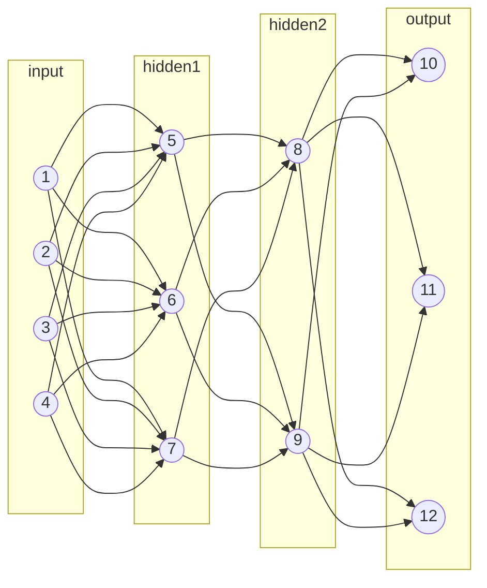

All vector computations need to be linear:
$$f(x) = \sum_{i=1}^{n} c_i x_i + b$$
or piece-wise linear:
$$  
f(x)\left\{\begin{array}{l}  
\sum_i c^{[1]}_i x_i + b^{[1]} \: , \: x \in S_1 \\  
\vdots \\  
\sum_i c^{[m]}_i x_i + b^{[m]} \: , \: x \in S_m  
\end{array}\right.  
$$
where $\cup_i S_i = \mathbb{R}^n$ and $\cap_i S_i = \varnothing$.   

>[!note]
>Neural Networks are an instance of differential programs.


## Defining Specifications

We define a language that specifies some properties about the functioning of a neural net. This will enable us to later on make statements and verify them based on the specifying language.

**Specifications** are generally of the form:
$$
\begin{aligned}
\{precondition\} \\
r \leftarrow f(x) \\
\{postcondition\}
\end{aligned}
$$
where both preconditions and post-conditions are statements that specify some property that is adjacent to input and output respectively. Properties dictate the input-output behaviour of the network (and not the internals). Specifications help in quantifying some properties for accurate verification. Each specification can be thought of as being structured in the following way:  

$$\underbrace{for \ any \ inputs \ x, y, \dots \ that \ \dots}_{precondition} \ the \ neural \ network \ G \ produces \ \underbrace{output \ that \ \dots}_{pst condition}$$

Although every possible specification needed for complete verification cannot be made, multiple specifications can be combined together to test for stronger properties. Preconditions are generally predicates or Boolean functions defined over set of variables which act as inputs to the system, and  post condition is a Boolean predicate over the variables appearing in precondition ($x_i$) and assigned variables ($r_i$).  
For any values of $x_1, \dots , x_n$ that make the precondition true, let $r_1 = f(x_1)$, $r_2 = g(x_2) \dots$ , where $f(), g(), \dots$ are the computations on the input, then the post condition must also be *True*.  

$$
\begin{aligned}
\{precondition\} \\
r_1 \leftarrow f(x_1) \\
r_2 \leftarrow g(x_2) \\
\vdots \\
\{postcondition\}
\end{aligned}
$$  
If the post condition is **False**, then the correctness property is not true, i.e., the property does not hold.  

Consider: c is an actual greyscale image, each element of c is the intensity of a pixel $\in (0, 1)$; we can state the following specification about the brightness of c and its corresponding classification:  
$$
\begin{aligned}
\{|x-c| \le 0.1 \} \\
r_1 \leftarrow f(x) \\
r_2 \leftarrow f(c) \\
\{class(r_1) = class(r_2)\}
\end{aligned}
$$  
$r_1$ and  $r_2$ are vectors whose elements are probabilities for a belonging to a class with labels corresponding to the indexes. $class(r_1)$ and  $class(r_2)$ extract the indexes corresponding to the largest elements of the vectors $r_1$ and  $r_2$ respectively.  

<div style="background-color: #080D11;"> <b>Counterexamples:</b> Valuations of variables in precondition that falsifies the post condition.</div>


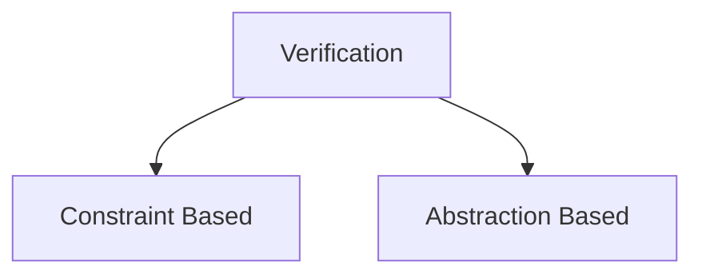

# Constraint-Based Verification

## Constraint-Based Satisfaction

A correctness property is taken and encoded as a set of constraints, solving which will help us to decide whether the property holds or not.

Let $fv(F)$ be the set of free variables appearing in the formula $F$. 

**Interpretation:** $I$ of $F$ is a map from variables present in $fv(F)$ to either $True$ or $False$. $I(F)$ denotes the formula where the variables have been replaced with their corresponding interpretations.  


***Example:***  
Let $F \triangleq (p \land q) \lnot r$, which means that $F$ is syntactically defined to be equal to the Boolean formula (as opposed to being semantically equivalent).  

$$
\begin{aligned}
\\ fv(F) = \{p, q, r\}
\\ I = \{ p \mapsto \text{True, } q \mapsto \text{False, } r \mapsto \text{True}
\} 
\\ I(F) \triangleq (\text{True} \land \text{False}) \lnot \text{True} 
\end{aligned}
$$

$eval(F)$: denotes the simplest form of $F$ we can get by evaluating repeatedly.  

$F$ is **satisfiable (SAT)** if there exists an $I$ s.t. $eval(I(F)) = True$, in which case, $I$ is the model of $F$: $I \models F$.   
$I \not \models F$ denotes $I$ isn't a model of $F$.  \
$I \not \models F$ if and only if $I \models \lnot F$.   \
$F$ is **unsatisfiable (UNSAT)** if $\forall I, \ eval(I(F)) = False$. 

**Validity:** If every interpretation $I$ is a model of $F$, then $F$ is valid.

Boolean satisfiability theories (SAT) can be generalised to more complex theories to include reals, vectors, strings, arrays, etc.; the problem of determining whether statements within these theories are true is known as **Satisfiability Modulo Theories** or simply **SMT**. We will be extensively using a first-order logic system called **Linear Real Arithmetic (LRA)** as it can represent a large class of neural networks and is decidable.  
In LRA, each propositional variable is replaced by a linear inequality of the form:
$$
\sum_{i=1}^{n} c_i x_i + b \le 0 \ \ \text{ OR } \ \ \sum_{i=1}^{n} c_i x_i + b \lt 0
$$  
where $c_i, b \in \mathbb{R}$.  

$$
(\ \underbrace{x+y \le 0}_{p} \ \land \ \underbrace{x-2y \lt 10}_{q} \ ) \ \lor \underbrace{x \ge 100}_{r}
$$  
An interpretation $I$ of $F$ is an assignment of every free variable to a real number.

## Encoding Neural Networks

We need to translate Neural Networks into a formula in LRA such that we can use SMT Solvers (specialised software that tests satisfiability for SMT problems).  

$f_v$: Function in node. \
$I$: Model. \
$F_v$: Encoding for node. \
$R_g$: Relational mapping for neural network.

>[!note]
>Generally Variables with a subscript $G$ refers to the overall neural network as a graph and those with a subscript v refers to individual nodes or a collection of nodes.

Whole Network can be defined as a binary relation:  
$$
R_G = \{ (a, b) | \ a \in \mathbb{R}^{n},\ b = f_G(a) \}
$$  
$R_v$, $f_v$ define the same for a single node $v$ in $G$ network. 

**For a single neuron with corresponding function $f_v: \mathbb{R} → \mathbb{R}$, both can be defined as:**

$$
f_v(x) = x + 1 \ \ \text{and} \ \ R_v = \{ (a, a+1)| \ a \in \mathbb{R} \}
$$
Thus the encoding for a node with one input is as follows
$$
F_v \triangleq v^o = v^{in, 1} + 1
$$
Models of $F_v$ will be of the form $\{ v^{in,1} \mapsto a, v^o \mapsto a +1 \}$ and have one-to-one correspondence with the elements of $R_v$.

**For two inputs:**
The formula for the encoding of a node with the function $f(x) = x_1 + 1.5x_2$ can be represented as  

$$F_v \triangleq v^o = v^{in, 1} + 1.5 v^{in, 2}$$  

**Generalizing encoding for any single node**:

Formalizing the operation $f_v$ of some node $v$. We assume that the function $f_v : \mathbb{R}^{n_v} \rightarrow \mathbb{R}$ is piecewise linear, i.e., of the form
$$
f(x)= \begin{cases}\sum_j c_j^1 x_j+b & \text { if } S_1 \\
\vdots & \\
\sum_j c_j^l x_j+b & \text { if } S_l\end{cases}
$$  

where $j$ ranges from $1$ to $n_v$. This generalizes representations to allow any one linear operation corresponding to some predetermined condition $S_i$. Each $S_i$ is defined as a formula in LRA over the elements of $x$. Thus, the encoding for the single node can be written as:
$$
F_v \triangleq \bigwedge_{i=1}^l\left[S_i \Rightarrow\left(v^{\mathrm{o}}=\sum_{j=1}^{n_v} c_j^i \cdot v^{\mathrm{in}, j}+b^i\right)\right]
$$  
if statement $S_i$ is $True$, then $v^o$ is equal to the $i^{th}$ equality. The statements are combined together using a conjunction over all possible inputs ($v^{in, j}$) to the node. Each clause joined using the conjunction is in $\text{condition} \implies \text{assignment}$ form providing the functionality of an **if** statement. So the general way to read this condensed statement is:
$$
\text{if } S_1 \text{ then } \dots \text{ AND if } S_2 \text{ then } \dots
$$  
**Example (ReLU):**

$$
relu(x)=\left\{\begin{array}{l}
x & \text{if} & x>0 \\
o & \text{if} & x \le 0
\end{array}\right.
$$  
The encoding for a simple ReLU function will be:

$$
F_v \triangleq(\underbrace{v^{\mathrm{in}, 1}>0}_{x>0} \Rightarrow v^0=v^{\mathrm{in}, 1}) \wedge(\underbrace{v^{\mathrm{in}, 1} \leqslant 0}_{x \leqslant 0} \Rightarrow v^0=0)
$$  
In order to ensure that we are making accurate representations of the actual system that we are modelling, we have to ensure that two qualities are always guaranteed for the encodings: **Soundness** & **Completeness**.  

**Soundness** - This is to make sure that our model does not miss any behaviour of $f_v$. Let $(\vec{a}, b) \in \mathbb{R}$  

$$
I = \{ v^{in, 1} \mapsto a_1, \dots, v^{in, n} \mapsto a_n, v^o \mapsto b\}
$$  
for any given tuple of $\vec{a}$ and $b$ which is an element of $R_v$, $I$ is a model of $F_v$ : $I \models F_v$. Soundness is the property of only being able to prove "true" things, any analysis about the system that is proven to be true, will be true.

**Completeness** - Any model of $F_v$ maps to a behaviour of $f_v$, so if for a model of $F_v$:  

$$
I = \{ v^{in, 1} \mapsto a_1, \dots, v^{in, n} \mapsto a_n, v^o \mapsto b\}
$$  
then $(\vec{a}, b) \in \mathbb{R}$. Completeness is the property of being able to prove all true things that can possibly exist in the system. This property can be used to determine *counterexamples* for any given model.

So far we have seen how to encode a singular node in a larger network. But to encode an entire Neural Net, we need to have the following structure:

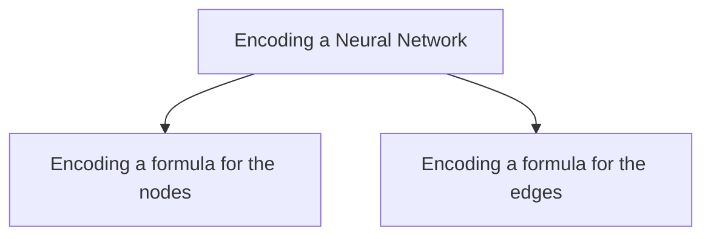

### Encoding the nodes:
for all non-input nodes we have:

$$
F_V \triangleq \bigwedge_{v \in V/V_{in}} F_v
$$  
Since the input nodes do not perform any operations, we are excluding them from the set using $V/V_{in}$.
$$
\text{the output of } v_1 \text{ is } \dots \text{ AND the output of } v_2 \text{ is } \dots
$$  
### Encoding the edges:
For some node $v \in V/V_{in}$ there exists a total ordering of edges: $(v_1, v), (v_2, v), \dots$
The total ordering tells us which edge feeds into which corresponding input index of the node.

$$
F_{o \rightarrow v} \triangleq \bigwedge_{i=1}^n v^{in, i} = v^o
$$  
$$
F_E = \bigwedge_{v \in V/V_{in}} F_{o \rightarrow v}
$$  
As per the total ordering of the input edges, $F_{o \rightarrow v}$ determines that the output of the $i^{th}$ node from the previous layer will become the $i^{th}$ input of the present node. The $v$'s present in the below diagram are the sequentially ordered nodes of the previous layer.

![[edgeEncoding.png]]

More concretely:  

$$
v^{[o]}_i \implies v^{[in, i]}
$$  

The entire network can be represented as a conjunction of the edges and nodes:
$$
F_G \triangleq F_V \ \land \ F_E
$$  
Assuming that we have ordered input nodes in $V_{in}$ 
Let $(a, b) \in R_G$ and let

$$
I = \underbrace{\{ v^o_1 \mapsto a_1, \dots , v^o_n \mapsto a_n \}}_{\text{input}} \cup \underbrace{\{ v^o_{n+1} \mapsto a_{n+1}, \dots, v^o_{n+m} \mapsto a_{n+m}\}}_{\text{output}}
$$  
Then there exists $I^\prime$ such that $I \cup I^\prime \models F_G$. 

>[!note]
>Size of encoding is linear in the size of the Neural Network

**Example:**  
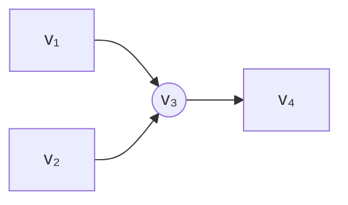
The functions corresponding to nodes $v_3$ and $v_4$ are as follows:  
$$f_{v_3}(x) = 2x_1 + x_2  \text{and} f_{v_4}(x) = \text{relu}(x)$$  
The formulations for each of the corresponding nodes will be:  
 
$$\text{Node } v_3 : \ F_{v_3} \triangleq v^o_3 = 2 v^{in, 1}_3 + v^{in, 1}_3 $$  
$$\text{Node } v_4 : \ F_{v_4} \triangleq (v^{in, 1}_4 > 0 \implies v^o_4 = v^{in, 1}_4) \land (v^{in, 1}_4 \le 0 \implies v^o_4 = 0)$$  
$$
\begin{aligned}
F_{o \rightarrow v_3} \triangleq (v^{in, 1}_3 = v^o_1) \land (v^{in, 2}_3 = v^o_2)
\\
F_{o \rightarrow v_4} \triangleq (v^{in, 1}_4 = v^o_3)
\end{aligned}
$$  
Encoding of $G$ :   $F_G \triangleq \underbrace{F_{v_3} \land F_{v_4}}_{F_V} \land \underbrace{F_{o \rightarrow v_3} \land F_{o \rightarrow v_4}}_{F_E}$  
So far we have been considering the linear operations that form the weights and biases for the nodes in a neural network, however, there are also non-linearities that are present.

*How to deal with non-linear activations?*

We can create representations of non-linear activation functions by over-approximation of said functions. Over-approximation is the partitioning of the function into different input domains and binding the outputs corresponding to each of these input domains to some defined output domain. For example; we can make an over-approximation for the Sigmoid ($\sigma (x)$) function by diving the function into appropriate intervals that roughly corresponds to its overall behaviour, i.e., anything less than a certain threshold will give us a 0, anything more than a certain threshold will give us 1 and any input values in between them will give us a value of roughly 0.5.

$$
\begin{aligned}
F_v \triangleq \ \ \ \ (v^{in, 1} \le -1 \implies 0 \le v^o \le 0.26) \land \\
 (-1 < v^{in, 1} \le 0 \implies 0.26 < v^o \le 0.5) \land \\
 (0 < v^{in, 1} \le 1 \implies 0.5 < v^o \le 0.73) \land \\
 (v^{in, 1} > 1 \implies 0.73 < v^o \le 1)
\end{aligned}
$$  
The above can be generalized to any monotonically increasing or decreasing function $f_v$ (which is all activation functions). Assume $f_v$ is monotonically increasing, sample a sequence of real values $c_1 < \dots < c_n$  

$$
\begin{aligned}
F_v \ \ \triangleq \ \ \ \ \ \ \ \ \ \ \ \ \ \ \  (v^{in, 1} \le c_1 \implies lb < v^o \le f(c_2) ) \\
\land (c_1 < v^{in, 1} \le c_2 \implies f_v(c_1) < v^o \le f(c_2)) \\
\vdots \\
\land (c_n < v^{in, 1} \implies f_v(c_n) < v^o \le ub \\
\end{aligned}
$$  
where $lb$ and $ub$ are the *lower bound and *upper bound* respectively. A point to note in the case of over-approximations are that they will give us soundness, but not completeness. Completeness essentially means that our encoding can find **counterexamples**, which we are abandoning in this case. Soundness means being able to prove correctness properties using an encoding, which is of highest priority for our models.

### A Concrete Example for checking Robustness


$$
f_G : \mathbb{R} \rightarrow \mathbb{R}^2
$$  
Where the output vectors in $\mathbb{R}^2$ correspond to:

$$
\begin{bmatrix}
\\
p(\text{cat}) \\
\\
p(\text{dog})\\
\\
\end{bmatrix}
$$  
Let the specification for this be:

$$
\begin{aligned}
\{ |x - c | \le 0.1\} \\
r \leftarrow f_G(x) \\
\{ r_1 > r_2 \}
\end{aligned}
$$  
where $c$ is the original image and $x$ is the perturbed image. The formula generated to check this statement is called a **Verification Condition** (VC), which if valid then ensures that the correctness property holds.

$$
(\underbrace{\text{precondtion}}_{p} \land \underbrace{\text{neural network}}_{G}) \implies \underbrace{\text{postcondition}}_{q}
$$  
inputs: $\{v_1, \dots, v_n\}$                    outputs: $\{v_{n+1}, v_{n+2}\}$                    Neural Network: $F_G$

$$
\underbrace{\left(\bigwedge^n_{i = 1} |x_i - c_i| \le 0.1 \right)}_{\text{precondition}} \land \underbrace{F_G}_{\text{network}} \land \underbrace{\left(\bigwedge^n_{i = 1} x_i = v^o_i \right)}_{\text{network input}} \land \underbrace{(r_1 = v^o_{n+1} \land r_2 = v^o_{n+2})}_{\text{network output}} \implies \underbrace{(r_1 > r_2)}_{\text{postcondition}}
$$  
LRA does not support vector operations hence the vector operations are decomposed into their constituent scalars. Absolute value operators are also not available in LRA, so we encode them as: $|x| \le 5  \xrightarrow{LRA} (x \le 5) \land (-x \le 5)$. We need to connect variables of $F_G$ with inputs $x$ and output $r$.

**For multiple Neural Networks, Correctness Properties have the form:**

$$
\begin{aligned}
\{P\} \\
r_1 \leftarrow f_{G_1}(x_1) \\
r_2 \leftarrow f_{G_2}(x_2) \\
\vdots \\
r_l \leftarrow f_{G_l}(x_l) \\
\{Q\}
\end{aligned}
$$  
For the above specification we have:

$$
\left( P \land \bigwedge^{l}_{i=1} F_i \right) \implies Q
$$  
For the above $F_i$ corresponds to $r_i \leftarrow f_{G_i}(x_i)$. $F_i$ combines encoding of the neural network $F_{G_i}$ along with connections with inputs and outputs, $x_i$ and $r_i$, respectively.

$$
F_i \triangleq F_{G_i} \land \left( \bigwedge^n_{j=1} x_{i,j} = v^o_i \right) \land \left( \bigwedge^m_{j=1} r_{i,j} = v^o_{n+j} \right)
$$  
$$
x_{i,j} \rightarrow v^o_i \rightarrow v^{in, 1}_i
$$  
**(soundness)** If $F$ is valid, then the correctness property is true.
**(completeness)** If it is invalid, we know there is a model $I \models \lnot F$ if $F$ is encodeable in LRA.

Assuming, input and output variables of the encoding of $G_i$ are $v_1, \dots, v_n$ and $v_{n+1}, \dots, v_{n+m}$; each graph $G_i$ has unique nodes and therefore input/output variables.

$$
\left( P \land^l_{i=l} F_i \right) \implies Q
$$  
The above reads as:    *"If the precondition is true and we execute all $l$ networks, then the postcondition should be true"*

**Example:**
$$
\begin{aligned}
\{ |x-1| \le 0.1 \} \\
r \leftarrow f(x) \\
\{ r \ge 1 \}
\end{aligned}
$$  
where $f(x) = x$. 

We take the input value $x$ to be equal to 0.99: $x = 0.99$. This is a valid value of $x$ as per the defined precondition.   
Therefore, we have: $f(x) \implies f(0.99) = 0.99$  
$F$ is invalid as $I \models \lnot F$, thus the correctness property does not hold. 

>[!info]
>In the formulations that we have gone over, disjunctions arise due to the ReLU function, due to its active/inactive states for all possible inputs to the Neural Network. Disjunctions cause problem during solving, as without them LRA (and a similar system called MILP) are polynomial time solvable. To solve LRAs with disjunction we either simplify the formulations by using lightweight techniques to discover whether ReLUs are active or not (abstraction-based verification). Alternatively, we can add additional bias to make all the ReLUs either always active or always inactive. Another thing to consider is that verified NNs in LRA may not really be robust when considering bit-level behaviour.

## DPLL (Davis-Putnam-Logemann-Loveland)

DPLL algorithm checks the satisfiability of Boolean formulae and underlies modern SMT and SAT solver. An extension of DPLL algorithm is needed to handle first-order formulae over different theories.

### Conjunctive Normal Form (CNF)

DPLL expects formulae that will be inputted to be in the shape of **Conjunctive Normal Form (CNF)**, all Boolean formulae must be written in CNF as can be seen below

$$
\text{CNF: } C_1 \land \dots \land C_n
$$  
where each sub-formula $C_i$ is called a ***clause*** and is for the form   
$$
l_1 \lor \dots \lor l_{m_i}
$$  
where each $l_i$ is called a ***literal*** and is either a **variable** ($p$) or its **negation** ($\lnot p$). Thus the structure of an entire input should be in the form:

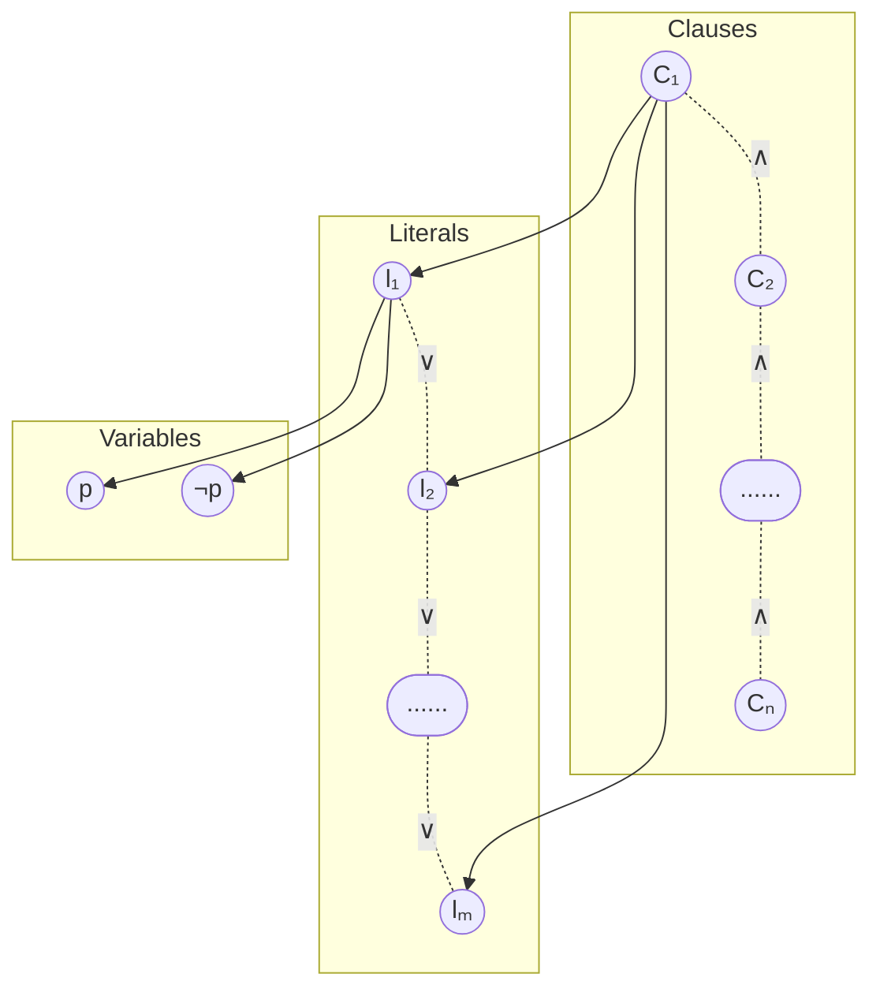

**DPLL has the following two alternating phases**


### Deduction

#### Boolean Constant Propagation (BCP)

The algorithm searches the Boolean CNF for clauses with single literals, i.e., clauses that contain only one Boolean variable instead of disjunctions of multiple literals. For a model to be satisfiable, the single literal must be $\text{True}$ if the variable is $p$ or $\text{False}$ if the variable is $\lnot p$.
$$
(l) \land C_2 \land \dots \land C_n
$$  
The BCP phase will look for all unit clauses and replace their literals with $\text{True}$.

**Example:**
$$
F \triangleq (p) \land (\lnot p \lor r) \land (\lnot r \lor q)
$$  
$$
\begin{align*} 
\text{BCP: } & (\text{True})\land (\lnot \text{True} \lor r) \land (\lnot r \lor q) \\ 
& \equiv (r) \land (\lnot r \lor q) \\
\\
\text{BCP: } & (\text{True}) \land (\lnot \text{True} \lor q) \\
& \equiv q\\
\\
\text{BCP: } & (\text{True})
\end{align*}
$$  


Thus $F$ is SAT with the model  
$$
\{ p \mapsto \text{True}, q \mapsto \text{True}, r\mapsto \text{True} \}
$$  
### Deduction + Search
```pseudocode
DPLL:
	Data: A formula F in CNF
	Result: I ⊧ F or UNSAT
▹ Boolean Constant Propagation (BCP)
	while there is a unit clause (l) in F do:
		Let F b F[F ↦ True]
	if F is True then return SAT
▹ Search
	for every possible variable in F do:
		If DPLL(F[p ↦ True]) is SAT then return SAT
		If DPLL(F[p ↦ False]) is SAT then return SAT
	return UNSAT
```

The model $I$ that is returned by DPLL when the input is SAT is maintained implicitly in the sequence of assignments to variables (of the form  $[l \mapsto \dots]$ and $[p \mapsto \dots]$). 

$$
\begin{align*}
F \triangleq & (p \lor r) \land (\lnot p \lor q) \land (\lnot p \lor \lnot r) \\
\text{recursion 1: }& F_1 = F[p \mapsto \text{True}] = q \land (\lnot q \lor \lnot r ) \\
\text{recursion 2: }& F_2 = F_1[q \mapsto \text{True}] = (\lnot r) \\
& F_3 = F_2[p \mapsto \text{FAlse}] = (\text{True})
\end{align*}
$$  
DPLL returns SAT and then implicitly builds the model for $F$:

$$
\{ p \mapsto \text{True}, q \mapsto \text{True}, r \mapsto \text{False} \}
$$  
**Partial Model:** DPLL can terminate with SAT and without assigning values to each and every variable, these incomplete models are called as partial models. The unfilled variables are essentially don't care variables and can be filled in any way we want. For $F \triangleq p \land (q \lor p \lor \lnot r) \land (p \lor \lnot q)$, $I = \{ p \mapsto \text{True} \}$ is a partial model.

### DPLL Modulo Theories

DPLL modulo theories or DPLLᵀ are extensions of DPLL over formulae in mathematical theories such as LRA. We essentially treat a formula completely by taking it as a Boolean, then incrementally add more and more theory info to conclusively prove SAT or UNSAT.

$$
\begin{align*}
F \triangleq & \ (x \le 0 \lor x \le 10) \land (\lnot x \le 0)\\
\\
F^B \triangleq & \ (p \lor q) \land (\lnot p)
\end{align*}
$$  

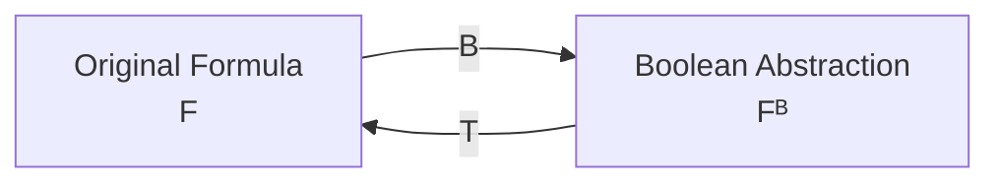
#### DPLLᵀ Algorithm

![[DPLL2.png]]

Constraints are lost in the abstraction process ($F \xrightarrow{B} F^B$) such as the relation between the different inequalities. If $F^B$ is UNSAT, then $F$ is UNSAT, but, if $F^B$ is SAT, it does not imply that $F$ is SAT.  
The DPLLᵀ algorithm first uses DPLL to check if $F^B$ is UNSAT following the properties of abstraction. IF $F^B$ is SAT, we will take the model $I$ returned by DPLL($F^B$) and map it to the formula $I^T$ in the theory we have abstracted the theory from (LRA in our case). If the theory solver deems $I^T$ satisfiable, $F$ is satisfiable. Otherwise, DPLLᵀ learns that $I^T$ is not a model so it negates $I$ and conjoins it to $F^B$. DPLLᵀ *lazily* learns more and more facts about the formula and refines the abstraction until the algorithm can decide SAT or UNSAT. The whole process is illustrated below:

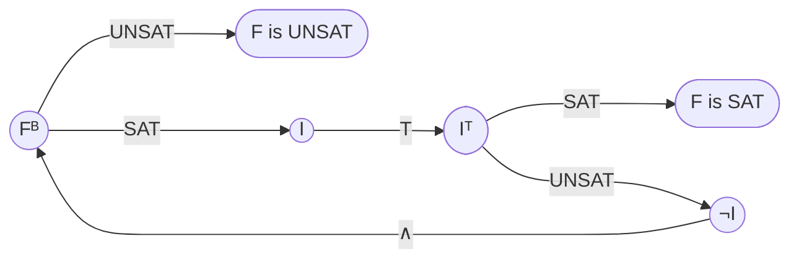

DPLL takes care of the disjunctions by taking clauses and searching for satisfiability by mapping literals to $\text{True}$ or $\text{False}$ values. DPLL assumes access to a theory solver to take care of the conjunctions of linear inequalities, in order to check their satisfiability. For LRA, the Simplex Algorithm can be used as a theory solver.

**Example:**

$$
\begin{align*}
\text{LRA: }& (x \ge 10) \land ((x < 0) \lor (y \ge 0)) \\
F^B \text{: }& p \land (q \lor r) \\
\\
I_1 =& \ \{ p \mapsto \text{True}, q \mapsto \text{True}\} \\
& p \land q \ \text{ : SAT} \\
\\
I^T_1 =& \ \underbrace{x \ge 10}_{p} \land \underbrace{x < 0}_{q} \ \text{ : UNSAT}\\
\\
F^B \land \lnot I_1 :& \ \ p \land (q \lor r) \land \underbrace{(\lnot p \lor \lnot q)}_{\lnot I_1} \\
I_2 =& \ p \land \lnot q \land r \\
\\
I^T_2 :& \ \{ x \mapsto 10, y \mapsto 0 \} \ \text{ : SAT}
\end{align*}
$$  

***How to convert Boolean formulae into CNF?***
Usually we use De Morgan's Law (however all are $O(exp)$)
What can be used: *Tseitin's Transformation* ($O(n)$)

### Tseitin's Transformation

$$
\large \underset{x \in S_{\text{var}}}{F} \xrightarrow{\text{Tseitin's Transformation}} \underset{x \in S^\prime_{\text{var}}}{F^\prime} \text{(CNF)}
$$

$$
S_\text{var} \subseteq S^\prime_\text{var}
$$

Any model of $F^\prime$ is also a model of $F$, if we disregard the interpretations of newly added variables. If $F^\prime$ is UNSAT, then $F$ is UNSAT, so we just need to invoke DPLL on $F^\prime$.

Tseitin’s transformation changes a formula of computations into a set of instructions, each containing one or two variables, connected by a single unary or binary operator respectively. For example:
```python
def f(x, y, z):
    pass
    return x + (2*y + 3)
```
The above function can be decomposed into a set of instructions, that when executed sequentially will provide the same result. For the above example, the function can be decomposed into the following instructions:
```python
def f(x,y,z):
    t1 = 2 * y
    t2 = t1 + 3
    t3 = x + t2
    return t3
```
If we are able to conjoin these sequential set of instructions, we will be converting the complex computation in non-CNF to CNF with added temporary variables $t_i$; Tseitin's transformation follows a similar procedure over Boolean formulae to generate a CNF.
#### Tseitin Step 1: NNF

**Negation Normal Form (NNF)** is achieved by pushing negation inwards so that $\lnot$ only appears next to variables, e.g., $\lnot p \lor \lnot r$ instead of $\lnot(p \land r)$.

$$
\begin{align*}
\lnot(F_1 \land F_2) &= \lnot F_1 \lor \lnot F_2 \\
\\
\lnot(F_1 \lor F_2) &= \lnot F_1 \land \lnot F_2 \\
\\
\lnot \lnot F_1 &= F_1
\end{align*}
$$  
#### Tseitin Step 2: Subformula Rewriting

Any subformula of $F$ that contains a conjunction/disjunction is called a subformula. We don't consider subformula at literal level.

$$
\large F \triangleq \underbrace{(\underbrace{p \land q}_{F_1}) \lor (\underbrace{\underbrace{q \land \lnot r}_{F_2} \land s}_{F_3})}_{F_4}
$$  
$F_1, F_2$ are the deepest level of nesting, $F_2$ is subformula of $F_3$. And all $F_i$ are subformulae of $F_4$.

Assuming $F$ has $n$ subformulae:
- For every subformula $F_i$ of $F$, create a fresh variable $t_i$. These variables are analogous to the temporary variables that was introduced to decompose some complex program
- Starting with the most deeply-rooted subformula: let $F_i$ be of the form $l_i \circ l^\prime_i$, where $\circ$ is $\land$ or $\lor$ and $l_i, l^\prime_i$ are literals.
One or both of $l_i$ and $l^\prime_i$ may be the new variable $t_j$ denoting a subformula $F_j$ of $F_i$, create the formula:

$$
F^\prime_i \triangleq t_i \Leftrightarrow (l_i \circ l^\prime_i)
$$  
These formulae are analogous to the assignments to temporary variables in code, where $\Leftrightarrow$ is the logical analogue of variable assignment (=). 

$$
\begin{align*}
F^\prime_1 & \triangleq t_1 \Leftrightarrow (p \land q) \\
F^\prime_2 & \triangleq t_2 \Leftrightarrow (q \land \lnot r) \\
F^\prime_3 & \triangleq t_3 \Leftrightarrow (t_2 \land s) \\
F^\prime_4 & \triangleq t_4 \Leftrightarrow (t_1 \lor t_3)
\end{align*}
$$  
$$
\begin{align*}
l_1 \Leftrightarrow (l_2 \lor l_3) & \equiv (\lnot l_1 \lor l_2 \lor l_3) \land (l_1 \lor \lnot l_2) \land (l_1 \lor \lnot l_3) \\
l_1 \Leftrightarrow (l_2 \land l_3) & \equiv (\lnot l_1 \lor l_2) \land (\lnot l_1 \lor l_3) \land (l_1 \lor \lnot l_2 \lor \lnot l_3)
\end{align*}
$$  
$$
F^\prime \triangleq t_n \bigwedge_i F^\prime_i
$$  
each $t_i$ is assigned true iff subformula $F_i$ evaluates to true. The constant $t_n$ in $F^\prime$ says that $F$ must be true, $t_n$ is like a return statement.

$$
F^\prime \triangleq t_n \land F^\prime_1 \land F^\prime_2 \land F^\prime_3 \land F^\prime_4
$$   
## Theory Solving

Theory solver for LRA receives $F$ formula as a conjunction of linear inequalities

$$
\bigwedge^n_{i=1} \left( \sum^m_{j=1} c_{ij} \cdot x_j \ge b_i \right) \ \text{ where } c_{ij}, b_i \in \mathbb{R}
$$  
Goal: Check SAT for $F$ and discover $I \models F$.

The Simplex Algorithm will be used as a theory solver, and it expects formulae to be conjunctions of equalities of the form $\sum_i c_i \cdot x_i = o$ and bounds of the form $l_i \le x_i \le u_i$, $u_i, l_i \in \mathbb{R} \cup \{ \infty, - \infty \}$. The infinities are included to ensure that variables with no upper/lower bounds are also adequately represented.

Converting inequalities into simplex (slack) form:

$$
\begin{gather*}
F \triangleq \bigwedge^n_{i=1} \left(\sum^m_{j=1} c_{ij} \cdot x_j \ge b_i \right) \\
s_i = \sum^m_{j=1} c_{ij} \cdot x_j \ \ \ \ \text{ AND } \ \ \ \ s_i \ge b_i
\end{gather*}
$$
where $s_i$: Slack Variable (analogous to tseitin temporary variables)

Let $F_s$ be the simplex form of some formula $F$. Then we have the following guarantees (analogue of Tseitin Transformation for non-CNF formulae):
- Any model of $F_s$ is a model of $F$, disregarding assignments to slack variables.
- If $F_s$ is UNSAT, then $F$ is UNSAT.

### Simplex Algorithm

**Goal:** Find a satisfying argument that maximizes some objective function. Our interest in verification is to find any satisfying assignment, so it will be a subset of Simplex.

The set of variables in simplex form is classified into two subsets:
- ***Basic Variables:*** those that appear on the left hand side of the equality; initially basic variables are the slack variables.
- ***Non-Basic Variables:*** all other variables.

At the beginning, basic variables: $\{s_1, s_2, s_3\}$ and non-basic: $\{x, y\}$, as Simplex progresses, formulae are rewritten so some basic variables may become non-basic and vice versa.

Simplex simultaneously looks for a model and a proof for unsatisfiability. Each equality defines a halfspace (something that splits $\mathbb{R}^2$ into two parts). Simplex starts from $I_0 = \{ x \mapsto 0, y \mapsto 0\}$ and toggles the values to satisfy all of the equalities. We are total ordering our variables to make it easier to refer to specific variables. We assumes variables are of the form $x_1, \dots ,x_n$. Given a basic variable $x_i$ and a non-basic variables $x_j$, we will use $c_{ij}$ to denote the coefficient of $x_j$ in the equality

$$
x_j = \dots + c_{ij} \cdotp x_j + \dots
$$  
for variable $x_i$, $l_i$ and $u_i$ denotes its lower and upper bound. (Non-Slack variables have no bounds)

Two invariants that are maintained in Simplex:
- $I$ always satisfies the equalities, so only bounds may be violated; initially true as all $0$ in $I$.
- Bounds of all non-basic variables are satisfied; initially true as they have no bounds.

For $x_i < l_i$, we need to update $x_i$ using any non-basic var $x_j$. Pick any $x_j$ with $c_{ij} \not = 0$. 
If no such $x_j$ exists that satisfies our condition $\implies$ UNSAT
Increase current interpretation by ${l_i - I(x_i)} \over {c_{ij}}$, interpretation of $x_j$ increases by ${l_i - I(x_i)}$, barely satisfying the lower bound, i.e., $I(x_i) = l_i$.

$$
\begin{align*}
&x_j \mapsto 0             &         &x_j \mapsto \frac{l_i - I(x_i)}{c_{ij}} \\
&x_i = \dots + 0 \dots     &    &x_i = \dots + c_{ij} \cdotp \frac{l_i - I(x_i)}{c_{ij}} \dots \\
&                          &    &x_i = \dots + {l_i - I(x_i)} \dots \\
& \because I(x_i) = 0 \text{ for previous interpretation} \\
& & &x_i = \dots + l_i + \dots \\
& &I(x_i) = \underbrace{I(x_i)}_{\text{previous}} + l_i
\end{align*}
$$  
After updating $x_j$, there is a chance that we might have violated the bounds of $x_j$ so we rewrite the equation such that $x_j$ becomes the basic variable and $x_i$ becomes the non-basic variable. The pivot operation follows as:

$$
\begin{gather*}
x_i = \sum_{k \in N} c_{ik} x_k \\
\\
x_j = \underbrace{-\frac{x_i}{c_{ij}} + \sum_{k \in N/\{j\}} \frac{c_{ik}}{c_{ij}}x_k}_{\text{replace } x_j \text{ with this}}
\end{gather*}
$$  
where $N$ is the set of indices of non-basic variables. For Simplex **basic variables are dependent variables and non-basic variables are independent variables**.

![[simplex.png]]

**Example:**
$$
\begin{gather*}
x+y \ge 0 \\
−2x + y \ge 2 \\
−10x + y \ge −5
\end{gather*}
$$  
Converting the set of equations into their slack form:
$$
\begin{gather*}
s_1 = x + y \\
s_2 = -2x + y \\
s_3 = -10x + y \\
s_1 \ge 0 \\
s_2 \ge 2 \\
s_3 \ge -5
\end{gather*}
$$  
Ordering $x, y, s_1, s_2, s_3$ and apply first model:
$$
I_0 = \{ x \mapsto 0, y \mapsto 0, s_1 \mapsto 0, s_2 \mapsto 0, s_3 \mapsto 0 \}
$$  
$s_1$ and $s_3$ are satisfied, $s_2$ is not: $I_0(s_2) = 0$ but $s_2 \ge 2$.

Modulate the first element in our ordering: $x$
Decrease $I_0(x)$ to $-1$ to meet $s_2$'s bounds.

$$
I_1 = \{ x \mapsto -1, y \mapsto 0, s_1 \mapsto -1, s_2 \mapsto 2, s_3 \mapsto 10 \}
$$  
Now we pivot with unchanged bounds:

$$
\begin{gather*}
x = 0.5y - 0.5 s_2 \\
s_1 = 1.5y - 0.5s_2 \\
s_3 = -4y + 5s_2
\end{gather*}
$$  
$I_1(s_1) = -1 < 0$, bound not satisfied.

New ordering of variables: $\underbrace{y}, s_2, x, s_1, s_3$
$I(y)$ value increased by $\frac{1}{1.5} = 2.3$ 
$$
I_2 = \left \{ x \mapsto -\frac{2}{3}, y \mapsto \frac{2}{3}, s_1 \mapsto 0, s_2 \mapsto 2, s_3 \mapsto \frac{7}{3} \right \}
$$  
At this point we pivot $y$ with $s_1$

Simplex terminates as $I_2 \models F$.

Simplex terminates due to the fact that the variables are ordered and we always look for the first variables violating bounds (Bland's Rule), this ensures that we never revisit the same set of basic and non-basic variables.

>[!note]
>Basic variables are dependent variables and Non-Basic variables are independent variables.

Using Simplex as the theory solver within DPLLᵀ allows us to solve for LRA, but this approach is not scalable as ReLUs are encoded as disjunctions. This is because the SAt-solving part of DPLLᵀ will handle it and consider every possible case of disjunction (active = x, inactive = 0), leading to many calls to Simplex, so we extend Simplex to Reluplex.

### Reluplex

Equations in reluplex form:
1. equations (same as simplex)
2. bounds (same as simplex)
3. ReLU constraints of the form: $x_i = relu(x_j)$ 
(also add bound(s) $x_i \ge 0$ implied by relu)

We call simplex on the weaker version (less constrained) formula of $F$ called $F^\prime$, which does not have any relu constraints. If $F^\prime$ is UNSAT, then $F$ is UNSAT.
$$
F \implies F^\prime \text{ (is valid)}
$$  
If Simplex returns $I \models F^\prime$, it may not be that $I$ satisfies $F$. If $I \not \models F$, we pick one of the violated relu constraints
$$
x_i = relu(x_j)
$$  
and modify $I$ to make sure that it is not violated. If any of $x_i$ or $x_j$ are basic, we pivot it with a non-basic variable. The pseudocode for Reluplex Algorithm can be found below:

![[reluplex.png]]

Note: Without Case Splitting, reluplex might not terminate - it may get stuck in a loop where the Simplex satisfies all bounds but violates a relu, then satisfying that relu causes a bound to be violated and so on.

We try to count whether a relu constraint has not been attempted to be fixed for more than $\tau$ times. $x_i = relu(x_j)$ is split into two cases: $F_1 \triangleq x_j \ge 0 \land x_i = x_j$ and $F_2 \triangleq x_j \le 0 \land x_i = 0$. Reluplex is recursively invoked on the two instances of the problem: $F \land F_1$ and $F \land F_2$.

If any of the instances are SAT, then $F$ is SAT.
$$
F \equiv (F \land F_1) \lor (F \land F_2)
$$  

# Abstraction Based Verification

Approximate (or Abstract) techniques for verification can have two possible outcomes:
- If they succeed, they can produce proofs of correctness for a neural network.
- If they fail, we do not know whether the correctness property holds or not.
 
Abstraction Based Verification techniques require specific techniques in order to abstractly define a domain of inputs to be given to a modified version of a neural network in order to test their robustness. There are mainly three ways of abstracting input domains for verification: **Interval Abstraction**, **Zonotope Domain Abstraction** and **Polyhedra Domain Abstraction**. 

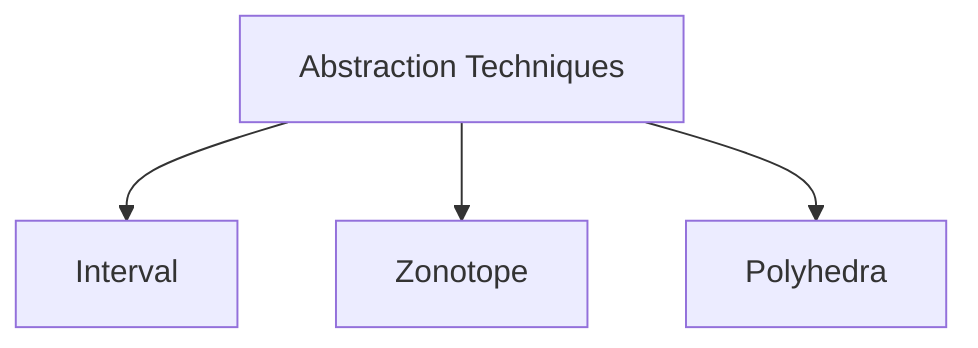

In ***Interval Abstraction***, we define an interval for each of the entire set of variables/predicates independently of each other, thereby defining a rectangular structure in some high dimensional space (hyperrectangles). 

In ***Zonotope Domains***, instead of defining hyperrectangles, the input domain is defined as a collection of parallelograms superimposed on each other created using auxiliary variables called generators whose values range from -1 to 1, each generator has its corresponding coefficient values which help in making a convex structure. The main difference between zonotopes and interval domains is that we can encode the relations between multiple variables/predicates using the generators. 

In ***Polyhedra Domain***, we have a setup similar to that of Zonotope Domains, however instead of the generator values ranging from -1 to 1, we have a set of linear inequalities bound together via conjunctions that determine the overall convex shape of the interval we are defining. 

These techniques have been described in more detail below:
## Neural Interval Abstraction

Using the specifications that have been defined beforehand, we see that it defines a system to test for individual images through a particular neural network.
$$
\begin{aligned}
\{|x - c| \le 0.1\} \\
r \leftarrow f(x) \\
\{class(r) = 1\}
\end{aligned}
$$
There is a great number of possible images $x$ that can be tested for, so we will try to lift the function $f(\dots)$ to work over a set of images instead in order to comprehensively test for possible examples. Thus we want to transform the neural network computation that is represented by $f$ 
$$
f: \mathbb{R}^n \rightarrow \mathbb{R}^m
$$  
to
$$
f^S: \mathcal{P}(\mathbb{R}^n) \rightarrow \mathcal{P}(\mathbb{R}^m)
$$  
where $\mathcal{P}(S)$ is the power set of set $S$. Thus, the newly defined mapping from a set of elements ($X$) to the set of all predictions corresponding to all elements of $X$ will following form:
$$
f^S(X) = \{ y \ | \ x \in X, \ y=f(x) \}
$$  
where $X$ is a set that is defined as per the specifications as the set of all $x \in X$ that are valid under the precondition. Which for our example will be:
$$
X = \{ x \ \big \vert \ |x - c| \le 0.1\}
$$  
To verify our property, we simply check:
$$
f^S(X) \subseteq \{y \ \big \vert \ class(y) = 1 \}
$$  
all runs of $f$ on every image $x \in X$ result in network predicting class $1$. We are defining $\infty$ set of inputs using data structures that we can manipulate called **abstract domains**. So we are taking a Neural Network and generating a version that can take a potentially infinite set of images, however during this abstraction process we will also be losing some precision, as we will be seeing soon. $f^S(X)$ is called the **concrete transformer** of $f$.  

***Example:***
The function is: $f(x) = x + 1$
Corresponding concrete transformer: $f^S(X) = \{x + 1 \ \big \vert \ x \in X\}$

Interval Abstract Domain considers an interval over $\mathbb{R}: \ \ [l, u]$
where $l, u \in \mathbb{R}$ and $l \le u$
$$
\{x \ \big \vert \ l \le x \le u\}
$$  
We simplify concrete transformer by considering only sets which have a nice form (Abstract Interpretation).
$$
f^a\left (\underbrace{\large [l, u]}_{\text{input interval}} \right ) = \underbrace{[l + 1 , u + 1]}_{\text{output interval}}
$$  
$f^a$ is the **abstract transformer** of $f$. Interval $[l, u]$ is infinite (considering $l < u$) so $f^a$ adds $1$ to an infinite set of reals. Expanding the above to any arbitrary $n^{th}$ dimension we have a n-dimensional interval (hyperrectangle) region in $\mathbb{R}^n$, i.e., set of all n-ary vectors
$\{ \overrightarrow{x} \in \mathbb{R}^n \ \big \vert \ l_i \le x_i \le u_i \}$

$$
\begin{align*}
&\mathbb{R}^n \text{ : hyperrectangle interval : } &([l_1, u_1],\dots, [l_i, u_i],\dots, [l_n, u_n]) \\
&\uparrow \\
&\vdots \\
&\mathbb{R}^3 \text{ : box interval : } &([l_1, u_1], [l_2, u_2], [l_3, u_3]) \\
&\uparrow \\
&\mathbb{R}^2 \text{ : rectangle interval : } &([l_1, u_1], [l_2, u_2]) \\
&\uparrow \\
&\mathbb{R} \text{ : line interval : } &([l, u])
\end{align*}
$$  

**Soundness:** We need to ensure that the $f^a$ designed is a sound approximation of $f^S$. Output of $f^a$ should be a superset of $f^S$ , as we do not want to miss any behaviour. For any interval $[l, u]$, we have: $f^S([l, u]) \subseteq f^a([l, u])$. 
Equivalently, for any $x \in [l, u]$, we have: $f(x) \in f^a([l, u])$
Although in practice we often see: $f^S([l, u]) \subset f^a([l, u])$ 

We are modifying the functions to take in intervals of inputs and output the interval that contains the set of all the mappings from the input interval. However, the interval domain cannot capture the relations between different dimensions (non-relational)
$$
X = \{(x, x) \ \big \vert \ 0 \le x \le 1\}
$$  
Best we can do is define the unit square between $(0, 0)$ and $(1, 1)$ which is denoted as the 2D interval $([0, 1], [0, 1])$. $X$ defines points where higher x-coordinates correspond to higher y-coordinates. Our abstract abstract domain can only represent rectangles whose faces are parallel to the axes. So instead of capturing the relation between two dimensions, we are simply saying that any value that is in $[0, 1]$ for $x$ can correspond to any value of $y$ in $[0, 1]$, thereby overapproximating for the function to the extent that we are unable to conserve any information about the relations between the two elements of the input.


***Example 1:***
Consider $f(x, y) = x + y$  
 
$f^S : \mathcal{P}(\mathbb{R}^2) \rightarrow \mathcal{P}(\mathbb{R})$ is defined as $f^S(X) = \{x + y \ \big \vert \ (x, y) \in X\}$   
$f^a$ is defined as a function that takes two intervals (a rectangle) representing range of values for $x_1$ and $x_2$
$$
\begin{gather*}
f^a([l, u],[l^\prime, u^\prime]) = [l + l^\prime, u + u^\prime] \\
\\
f^a([1, 5], [100, 200]) = [101, 205]
\end{gather*}
$$  
Take any $(x, y) \in ([l, u],[l^\prime, u^\prime])$
By definition, $l \le x \le u$ and $l^\prime \le y \le u^\prime$, so $l + l^\prime \le x + y \le u + u^\prime$ thus $x + y \in [l + l^\prime, u + u^\prime]$ proving soundness.


***Example 2:***
Consider $f(x, y) = x \times y$ 
For only positive inputs to $f^a$ : $f^a([l, u], [l^\prime, u^\prime]) = [l \times l^\prime, u \times u^\prime]$
However,
$$
f^a([-1, 1], [-3, -2]) = [3, -2]
$$  
We were expecting $l \times l^\prime \le u \times u^\prime$ but we got $l \times l^\prime \ge u \times u^\prime$ which would mean that the result is not a proper interval. Thus we have to compute the interval domain in a different way:
$$
f^a([l, u],[l^\prime, u^\prime]) = [min(B), max(B)]
$$  
where
$$
B = \{ l \times l^\prime, \ l \times u^\prime, \ u \times l^\prime, \ u \times u^\prime \}
$$  
For the above numerical example we therefore have:
$f^a([-1, 1], [-3, -2]) = [min(B), max(B)] =[-3, 3]$

These were all basic abstract transformers that overapproximate for some given binary function.

#### Affine Function:

$f(x_1, \dots, x_n) = \sum_i c_i x_i$ where $c_i \in \mathbb{R}$, we can define the abstract transformer as:
$$
f^a([l_1, u_1], \dots, [l_n, u_n]) = \left [ \sum_i l^\prime_i, \sum_i u^\prime_i \right]
$$  
where $l^\prime_i = \text{min}(c_il_i, c_i u_i)$ and $u^\prime_i = \text{max}(c_il_i, c_i u_i)$, trying to cover the largest area possible.

**Example:**
$f(x, y) = 3x + 2y$
$f([5, 10], [20, 30]) = [3 \times 5 + 2 \times 20, 3 \times 10 + 2 \times 30 ] = [55, 90]$

#### Monotonic Function:
$f : \mathbb{R} \rightarrow \mathbb{R}$
$f^a([l, u]) = [f(l), f(u)]$

**Example:**
ReLU in the domain $[3, 5]$
$relu(3) \le relu(x) \le relu(5)$
Therefore, $f^a([3, 5]) = [relu(3), relu(5)]$

### Composing Abstract Transformers:

For $(f \circ g)(x)$ we do not need to define a different transformer, we can define one for $f \ (f^a)$ and one for $g \ (g^a)$ and compose them to find a sound abstract transformer of $f \circ g$ : $f^a \circ g^a$

**Example:**
$g(x) = 3x$,  $f(x) = relu(x)$ and $h(x) = f(g(x))$
Affine followed by ReLU and output in $\mathbb{R}$
$$
h^a([2, 3]) = f^a(g^a([2, 3])) = f^a([6, 9]) = [6, 9]
$$  

### Abstractly Interpreting Neural Networks

For a network $G = (V, E)$ we have: $f_G : \mathbb{R}^n \rightarrow \mathbb{R}^m$ where $n = |V^{in}|, m = |V^{out}|$
- $f^a_G$ takes $n$ intervals and outputs $m$ intervals
- for every output node $v_i$: $\text{out}^a(v_i) = [l_i, u_i]$ (note: we have a fixed ordering of nodes)
- for every non-input node $v$ : $\text{out}^a(v) = f^a_v(\text{out}^a(v_1), \dots, \text{out}^a(v_k))$ where $f^a_v$ is the abstract transformer of $f_v$ and $v$ has incoming edges $(v_1, v), \dots,(v_k, v)$
- the output of $f^a_v$ is the set of intervals $\text{out}^a(v_1), \dots, \text{out}^a(v_m)$ where $v_1, \dots, v_m$ are output nodes

**Example:**
$f_{v_3}(x) = 2x_1 + x_2$
$f_{v_4}(x) = relu(x)$

$f^a_G([0, 1], [2, 3])$:

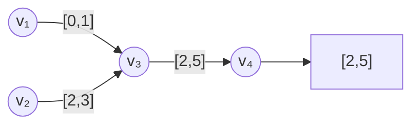
$$
\begin{gather*}
\text{out}^a(v_1) = [0, 1] \\
\text{out}^a(v_2) = [2, 3] \\
\text{out}^a(v_3) = [2 \times 0 + 2, 2 \times 1 + 3] =[2, 5] \\
\text{out}^a(v_4) = [relu(2), relu(5)]
\end{gather*}
$$  
### Limitations
Interval Domain often overshoots and computes wildly overapproximated solutions.

**Example 1:**
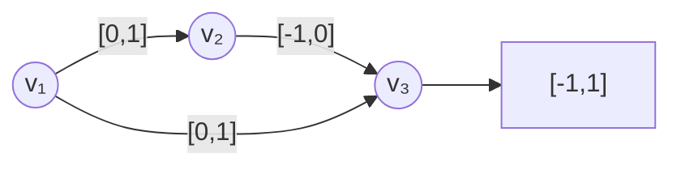
$f_{v_3}(x) = -x$
$f_{v_4}(x) = x_1 + x_2$

So we can see that $f_G(x) = 0$
Expected abstract transformer should be: $f^a_G([l, u]) = [0, 0] \ \forall l, u \in \mathbb{R}$ 
But $f^a_G([l, u])$ returns $[-1, 1]$ since it does not know the relation between $-x$ and $x$. 

**Example 2:**
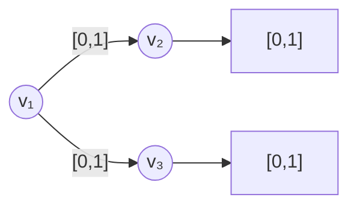
$f_{v_2}, f_{v_3}$ are both relus. 
$f_G(x) = (x, x)$ is the desirable result
However, $f^a_G([0, 1]) = ([0,1], [0, 1])$ is the result.
$f^a_G$ tells us that for inputs between $0$ and $1$, the neural network can output $(x, y)$ where $0 \le x, y \le 1$ which is a loose approximation, we needed $0 \le x \le 1$.

We cannot capture set of points where $x=y$ and $0 \le x \le 1$, instead we can give $([0,1], [0, 1])$, syntactically an abstract element in the interval domain is captured by constraints of the form:
$$
\bigwedge_i l_i \le x_i \le u_i
$$  
Every inequality involves a single variable and fails to capture relationships so interval domain is called non-relational. To address these limitations we will be turning towards Zonotope-based abstraction methods.

## Zonotope: Relational Abstract Domain

Assume that we have a set of $m$ real-valued generator variables $\epsilon_1, \dots, \epsilon_m \in [-1, 1]$. A $1D$ zonotope is the set of all points in the set
$$
\left \{ c_0 + \sum^m_{i=1} c_i \epsilon_i \ \big \vert \ \epsilon_i \in [-1, 1] \right \}
$$  
where $c_i \in \mathbb{R}$.
For 1 generator variable:
$$
\left \{ c_0 +  c_1 \epsilon_1 \ \big \vert \ \epsilon_1 \in [-1, 1] \right \}
$$ 
This is just defining an interval of the form $[c_0 - c_1, c_0 + c_1]$, assuming $c_1 \ge 0$. In the defined interval, $c_0$ is the centre. For a one dimensional zonotope this can be interpreted as the point $c_0$ being stretched in both the available directions with the magnitude of $c_1$.
$$
c_0 - c_1 \leftarrow c_0 \rightarrow c_0 + c_1
$$  
Zonotopes are more expressive from $\mathbb{R}^2$ and above. Thus, similarly for multiple generator variables, we can observe the same "stretching" effect. The initial coordinates are stretched into a line which represents a specific vector with endpoints at $(c_{10} + c_{11}, c_{20} + c_{21})$ and $(c_{10} - c_{11}, c_{20} - c_{21})$. The vector is then stretched by another generator into a parallelogram. The more generator variables there are, the more faces there are in the resulting zonotope. However each zonotope can be described a convex figure resulting from the summation of different parallelograms.
![[zonotope1.svg | center]] 
The name zonotope is derived from zona meaning 'belt' in Latin. Zonotopes are named such as we can trace an uninterrupted path through the parallel vectors that wrap around the figure like a belt.
![[zonotope2.svg | center]]

In n-dimensions, a zonotope with m-generators is the set of all points
$$
\left \{ \left (\underbrace{c_{10} + \sum^m_{i=1} c_{1i}\epsilon_i}_{\text{first dimension}}, \dots , \underbrace{c_{n0} + \sum^m_{i=1} c_{ni}\epsilon_i}_{\text{nth dimension}} \right) \ \big \vert \ \epsilon_i \in [-1,1] \right \}
$$  
**Example:**
$(1 + \epsilon_1, 2 + \epsilon_2)$
$(1 + \epsilon_1 + 0\epsilon_2, \ 2 + 0\epsilon_1 + \epsilon_2)$
Centre will be $(1, 2)$, the centre of the zonotope is always the vector of the constant coefficients.

$(2 + \epsilon_1, 2 + \epsilon_1)$
Two dimensions are equal, so we get a line shape centred at $(2, 2)$.
Zonotopes allow us to model relational intervals with the help of the generator variables. Above we see a zonotope modelling an interval that follows $(x, x)$.

$(2 + \epsilon_1, 3 + \epsilon_1 + \epsilon_2)$
coefficients of $\epsilon_1$ are $(1, 1)$ so it stretches the centre $(2, 3)$ along the $(1, 1)$ vector

![[zonotope1.png]]

coefficients of $\epsilon_2$ are $(0, 1)$ so it stretches all points along $(0, 1)$ vector

![[zonotope2.png]]

Above is the final zonotope, adding more and more faces adds more faces to the zonotope.
$$
\left \{ \left (\underbrace{c_{10} + \sum^m_{i=1} c_{1i}\epsilon_i}_{\text{first dimension}}, \dots , \underbrace{c_{n0} + \sum^m_{i=1} c_{ni}\epsilon_i}_{\text{nth dimension}} \right) \ \big \vert \ \epsilon_i \in [-1,1] \right \}
$$  
We will use a compact notation to signify the above equation, it will be defined as a tuple of vectors of coefficients
$$
(\langle c_{10}, \dots, c_{1m} \rangle, \dots, \langle c_{n0}, \dots, c_{nm}\rangle)
$$  
for an even more compact notation
$$
(\langle c_{1i} \rangle_i, \dots, \langle c_{ni} \rangle_i)
$$  
where $i$ ranges from $0$ to $m$, the number of generators.
We can compute the upper bound of the zonotope in the $j$th dimensionby solving the following optimization problem:
$$
\begin{gather*}
\text{max } c_{j0} + \sum^m_{i=1} c_{ji}\epsilon_i \\
\text{s.t. } \epsilon_i \in [-1, 1]
\end{gather*}
$$  
which can easily be solved by setting $\epsilon_i$ to $1$ if $c_{ji} > 0$ and $-1$ otherwise.

Similarly, we can compute the lower bound of the zonotope in the j-th dimension by minimizing instead of maximizing, solving the optimization problem by setting $\epsilon_i = -1$ if $c_{ji} > 0$ and $0$ otherwise.

**Example:**
$(2 + \epsilon_1, 3 + \epsilon_1 + \epsilon_2) \implies (\langle 2, 1, 0 \rangle, \langle 3, 1, 1 \rangle)$

Upper Bound in vertical dimension: $3 + \epsilon_1 + \epsilon_2 \ ; \ \epsilon_1, \epsilon_2 = 1 \implies 3 + 1 + 1 = 5$

$f(x, y) = x + y$

Define: $f^a$

$f^a(\langle c_{10}, \dots, c_{1m} \rangle, \langle c_{20}, \dots, c_{2m}\rangle)$ compare to $f^a([l_1, u_2], [l_2, u_2])$  

$$\implies \langle c_{10} + c_{20}, \dots,  c_{1m} + c_{2m} \rangle$$

$(0 + \epsilon_1, 1 + \epsilon_2) \ \ : \ f^a(\langle 0, 1, 0\rangle, \langle 1, 0, 1 \rangle) =\langle 1, 1, 1 \rangle$  

output zonotope is the set $\{ 1+ \epsilon_1 + \epsilon_2 \ \big \vert \ \epsilon_1, \epsilon_2 \in [-1, 1]\}$ which is the interval $[-1, 3]$.

#### Affine Functions

$$
f(x_1, \dots, x_n) = \sum_j a_j x_j 
$$  
where $a_j \in \mathbb{R}$.  
$$
f^a(\langle c_{1i} \rangle, \dots, \langle c_{ni} \rangle) = \left \langle \sum_j a_jc_{j0}, \dots, \sum_j a_jc_{jm} \right \rangle
$$  
$f(x, y) = 3x + 2y$  
$f^a(\langle 1, 2, 3 \rangle, \langle 0, 1, 1 \rangle) = \langle f(1, 0), f(2, 1), f(3,1) \rangle = \langle 3, 8, 11 \rangle$  
$3 + 8\epsilon_1 + 11\epsilon_2 \ \ \ \ \epsilon_1, \epsilon_2 \in [-1,1]$  

### Abstract Transformer of Activation Functions

For intervals domains we had: $relu^a([l, u]) = [relu(l), relu(u)]$  
This formulation does not know how the inputs are related to their corresponding outputs. Geometrically the interval domain of ReLU approximates the function with a box as shown below:
![[relu1.png]]
The breadth of the box depends on the lower bound of the interval, i.e., whether $l$ is positive or negative. Using zonotopes, the ReLU abstract transformer is build using a 1-dimensional zonotope $\langle c_ i\rangle_i$ as input

$$
relu^a(\langle c_i \rangle_i) =
\begin{cases}
\langle c_i \rangle_i \ \text{ for } l \ge 0 \\
\\
\langle 0 \rangle_i \ \text{ for } u \le 0 \\
\\
? \ \ \ \ \ \text{ otherwise}
\end{cases}
$$  
If the lower bound is greater than zero, we return the input, if the upper bound is lesser than or equal to zero we return zero. Since zonotopes allows for relating input and output, we can shear the rectangles to form better approximations of ReLU.

![[relu2.png]]

The bottom face of the zonotope is $y = λx$, for some slope $\lambda$. The top face is $y = λx + u(1 − λ)$. For $λ = 0$, we get the base rectangle that is the interval domain for the ReLU, the steepness of the shear depends on the $\lambda$ parameter, which cannot be more than $u/(u − l)$ to ensure that the parallelogram covers the ReLU along the input range $[l, u]$. The distance between the top and bottom faces of the parallelogram is $u(1 − λ)$, Thus the centre of the zonotope is at the point
$$
η = \frac{u(1 − λ)}{2}
$$  
With this information, we can now complete the definition of $relu^a$ as follows:
$$
relu^a(\langle c_i \rangle_i) =
\begin{cases}
\langle c_i \rangle_i \ \text{ for } l \ge 0 \\
\\
\langle 0 \rangle_i \ \text{ for } u \le 0 \\
\\
\langle λc_1, . . . , λc_m, 0〉 + \langle η, 0, 0, . . . , η〉 \text{ otherwise}
\end{cases}
$$  
we have added a new generator, $\epsilon_{m+1}$, in order to stretch the parallelogram in the vertical axis; its coefficient is $η$, which is half the height of the parallelogram. We also add the input zonotope scaled by $λ$ with coefficient $0$ for the new generator to ensure that we capture the relationship between the input and output.

## Neural Polyhedron Abstraction

So far we have been approximating functions using a hyperrectangle with interval domains but it was non-relational, the zonotope domain allows us to approximate functions using a zonotope, e.g., a parallelogram and capture relations between different dimensions. The **polyhedron domain** is a more expressive abstract domain as it enables us to approximate functions using any arbitrary complex polyhedra. A **polyhedron** in $\mathbb{R}^n$ is a region made of straight faces. Convex polyhedra are shapes that have any two points of the shape completely contained in the shape and can be specified as a set of linear inequalities. This approximation is more precise for ReLU functions than those afforded by the interval and zonotope domains as the shapes used to approximated are not limited to hyperrectangle or parallelograms.

$$
\begin{align*}
&\textbf{interval domain} &\rightarrow& &\textbf{zonotope abstract domain} \ \ &\rightarrow& &\textbf{polyhedra abstract domain} \\
&\text{abstracts a function} && &\text{approximates a function using} \ \ && &\text{approximates a function using} \\
&\text{using a hyperrectangle} && &\text{zonotopes/paralleloprams} \ \ && &\text{arbitrary convex polyhedra}
\end{align*}
$$

Polyhedra are defined in a manner analogous to a zonotope abstractions, using a set of $m$ generator variables, $\epsilon_1, \dots , \epsilon_m$ which are then bounded by a set of linear inequalities instead of being limited to the interval $[−1, 1]$ as is the case for zonotopes.

A zonotope in $\mathbb{R}^n$
$$
\left \{ \left (c_{10} + \sum^m_{i=1} c_{1i}\epsilon_i, \dots , c_{n0} + \sum^m_{i=1} c_{ni}\epsilon_i \right) \ \big \vert \ F(\epsilon_1, \dots , \epsilon_m) \right \}
$$  
where $F(\epsilon_1, \dots , \epsilon_m)$ is a Boolean statement that evaluates to $true$ iff all of its arguments are in $[−1, 1]$. For a polyhedron $F$ is defined as a set (conjunction) of linear inequalities over the generator variables, e.g., 
$$
F(\epsilon_1, \epsilon_2) \equiv 0 \le \epsilon_1 \le 5 \land \epsilon_1 = \epsilon_2
$$  
$F$ defines a bounded polyhedron over the generator variables, giving a lower and upper bound for each generator, e.g., $\epsilon_1 \le 0$ is not allowed, because it does not enforce a lower bound on $\epsilon_1$. In the 1-dimension, a polyhedron is simply an bounded interval. 

To find the upper and lower bounds of a polyhedron, we need to solve a linear program which takes polynomial time in the number of variables and constraints. 

To compute the lower bound of the $j$-th dimension, we solve for the following:
$$
\text{min } c_{j0} + \sum^m_{i=1} c_{ij} \epsilon_i
$$ 
Similarly to calculate the upper bound of $j$-th dimension, we just take the $\text{max}$ instead of minimizing the generator terms.

A given polyhedra in $\mathbb{R}^n$
$$
\left \{ \left (c_{10} + \sum^m_{i=1} c_{1i}\epsilon_i, \dots , c_{n0} + \sum^m_{i=1} c_{ni}\epsilon_i \right) \ \big \vert \ F(\epsilon_1, \dots , \epsilon_m) \right \}
$$  
will be abbreviated as:
$$
(\langle c_{1i}\rangle_i, \dots, \langle c_{ni}\rangle_i, F)
$$  
**Example:**
Given polyhedron: $\{(\epsilon_1, \epsilon_2) | F(\epsilon_1, \epsilon_2)\}$

$F \equiv (0 \le \epsilon_1 \le 1) \land (\epsilon_2 \le \epsilon_1) \land (\epsilon_2 \ge 0)$

From the Boolean function we can understand that a bounded x-y space is being defined. For ease of visualisation, we can replace $\epsilon_1$ and $\epsilon_2$ with $x$ and $y$ which gives us a set pf equations that  $x$ and $y$ must satisfy:
$$
\begin{align*}
&0 \le x \le 1 \\
&y \le x \\
&y \ge 0
\end{align*}
$$ 
This set of equations clearly defines a LP problem in the shape of a triangle situated in the first quadrant of the x-y plane. Thus the polyhedron comprises of all of the points inside this triangle.

$(\langle 0, 1, 0 \rangle, \langle 0, 0, 1 \rangle, F)$ 

We need to solve for the following four equations to get the upper and lower bound on the generators
$$
\begin{align*}
&\text{max } \epsilon_1& &\text{min } \epsilon_1& &\text{max } \epsilon_2& &\text{min } \epsilon_2& \\
&\text{s.t. } F& &\text{s.t. } F& &\text{s.t. } F& \ &\text{s.t. } F& \ 
\end{align*}
$$  
Thus the valid interval domains of the generators are: $\epsilon_1 \in [0, 1]$ and $\epsilon_2 \in [0, 1]$. 

### Abstract Transformers for Polyhedra

#### Affine Functions

For an affine function $f(x_1, \dots, x_n) = \sum_j a_j x_j \ \ \ \ \ a_j \in \mathbb{R}$
We will have the following abstract transformer:
$$
f^a(\langle c_{1i}\rangle, \langle c_{ni} \rangle, F) = \left( \left\langle \sum_j a_j c_{j0}, \dots, \sum_j a_j c_{jm} \right \rangle, \ F \right) 
$$ 
the set of linear equalities does not change between input and output of the function.

**Example:**

$f(x, y) = 3x + 2y$

$f^a(\langle 1, 2, 3 \rangle, \langle 0, 1, 1\rangle, F) = (\langle 3, 8, 11 \rangle, F)$

***The abstract transformer for ReLU generated in polyhedron domain:***

![[polyhedra1.png]]

$relu^a$ in convex polyhedra

Top face: $y = \frac{u(x − l)}{u - l}$ from the equation of a straight line, where $x_1=l$, $x_2=u$ and  $y_1=relu(l)$, $y_2=relu(u)$. 

We need to compute the shaded area which is bounded by $y = 0$ from below, $y = x$ from the right, and $y = \frac{u(x − l)}{u - l}$ from above.
We define $relu^a$ as
$$
relu^a(\langle c_i\rangle_i, F) = (\langle \underbrace{0, 0, \dots , 0}_m, 1 \rangle , F^\prime)
$$  
where 
$$
F^\prime \equiv F \land \left (\epsilon_{m+1} \le \frac{u(\langle c_i \rangle − l)}{(u − l)}\right) \land (\epsilon_{m+1} \ge 0) \land (\epsilon_{m+1} \ge \langle c_i\rangle)
$$  
- $l$ and $u$ are the lower and upper bounds of the input polyhedron that can be computed using linear programming. 
- $〈c_i〉_i$ is being used to denote the full term $c_0 + ∑^m_{i=1} c_i\epsilon_i$. 
- And a new generator, $\epsilon_{m+1}$ has been added, the new set of constraints $F^\prime$ relates this new generator to the input, effectively defining the shaded region.

Condensing the constraints into two dimensions:
$$
relu^a(\langle 0, 1 \rangle, -1 \le \epsilon_1 \le 1) = (\langle 0, 0, 1 \rangle, F^\prime)
$$

where $\epsilon_1$ determines $x$ and $\epsilon_2$ determines $y$ thus,
$$
F^\prime \equiv \left(-1 \le \epsilon_1 \le 1\right) \land \left(\epsilon_2 \le \frac{\epsilon_1 + 1}{2}\right) \land (\epsilon_2 \ge 0) \land (\epsilon_2 \le \epsilon_1)
$$  
### Abstractly Interpreting Neural Networks

$G = (V, E) \ \ \ \ \ \ \ f_G : \mathbb{R}^n \rightarrow \mathbb{R}^m$
$$
f^a_G : \text{n-dimensional polyhedron} \rightarrow \text{m-dimensional polyhedron}
$$ 
$f^a_G(\langle c_{1j} \rangle, \dots, \langle c_{nj} \rangle, F)$

- For every input node $v_i$, we have $out^a(v_i) = (\langle c_{ij} \rangle_j, F)$

- For every non-input node $v$ we have $out^a(v) = f^a_v(p_1, \dots, p_k, \bigwedge^n_{i=1} F_k)$ where $f^a_v$ is the abstract transformer of $f_v$, $v$ has incoming edges $(v_1, v), \dots, (v_k, v)$ and $out^a(v_i) = (p_i, F_i)$

- output of $f^a_G$ is the $m$-dimensional polyhedron  $\left( p_1, \dots, p_m, \ \bigwedge^m_{i=1} F_i \right)$, where $v_1, \dots, v_m$ are the output nodes and $out^a(v_i) = (p_i, F_i)$

Some abstract transformers for activation functions add new generators, we assume all of them were already in the polyhedron but with coefficients set to $0$, they get non-zero coefficients only in the output of activation functions.

## Abstract Interpretation based Verification

For verification using the Hoare triplet to work, we require the a sound representation of the set of val of $x$ in the abstract domain. Along with the abstract representation of the neural network $f$ on all values of $x$ that results in an over-approximation of the values of $x$. We also need to check that all values of $r$ satisfy the postcondition.

The generic precondition can be defined as:
$$
\begin{aligned}
\{ \Vert x - c \rVert_p \le \epsilon \} \\
r \leftarrow f(x) \\
\{ \text{class}(r) = y \}
\end{aligned}
$$ 
Here for the sake of generality, we do not specify a particular norm, instead we define an $l_p$-norm. The main norms that we will be considering in this case are the $l_2$-norm and the $l_\infty$-norm both of which are distance metrics but serve very different purposes.

$$
l_p \text{ norm: } \lVert z \rVert_p
\begin{cases}
l_2 \text{ norm: } \ \lVert z \rVert_2 = \sqrt{\sum_i | z_i |^2} \\
\\
l_\infty \text{ norm: } \ \lVert z \rVert_\infty = \underset{i}{max} |z_i|\\
\end{cases}
$$ 
$l_2$-norm is the length of the straight line between two images in $\mathbb{R}^n$ and $l_\infty$-norm is the largest discrepancy between two corresponding pixels. They have their own usability based on what kinds of deviations we wish to categorize.
If there is a great deal of variability restricted to some locality of the image we can use $l_2$-norm as it allows a small number of pixels to significantly differ in brightness. If the noise is random and spread out through the entire image, $l_\infty$-norm is more suitable as it bounds the maximum discrepancy a corresponding pixels in the two images can have.

### Abstracting the Precondition

We have the precondition as: $\{ x | \lVert x - c \rVert_\infty \le \epsilon \}$ 

Interval: $I = ([c_1 - \epsilon, c_1 + \epsilon], \dots,[c_n - \epsilon, c_n + \epsilon])$
$\lVert \cdot \rVert_\infty$ allows us to take elements of $c$ and change it by $\epsilon$ independently of other dimensions. 
Define abstract transformer $f^a(I) = ([l_1, u_1], [l_2, u_2], \dots, [l_m, u_m])$

$I^\prime = ([l_1, u_1], [l_2, u_2], \dots, [l_m, u_m])$ represents all possible values of $r$ and more. 

We have to prove that $\forall r \in I^\prime$, $class(r) = y$
We see that 
if $l_y > u_i \ \ \forall i \not = y$
then, $\forall r \in I^\prime, \ \ class(r) = y$

If $y$-th interval is larger than all others, then we know that the classification is always $y$. 

Note: if $l_y \le u_i$ for some $i \not = y$, then we cannot disprove this property, so this is a one-sided check. In simpler words, since we will be receiving a range of probabilities corresponding to each of the class indices. We will be choosing the class whose lower bound probability ($l_y$) is higher than all other upper bounds of all other class ($u_i$). We will be picking the non-overlapping bound with highest lower bound. If there is any overlap between the range of probabilities, we cannot be entirely sure as to which class the resulting probability belongs to inside of the overlapping region. Thus making this is a one-sided check.
![[verifyabsint.png | center]] 
**Example:**

$f^a(I) = I^\prime = ([0.1, 0.2], [0.3, 0.4])$
$class(r) = 2 \ \ \ \forall r \in I^\prime$

where
$I^\prime = ([0.1, 0.2], [0.15, 0.4])$

two intervals overlap in the 0.15 to 0.2 region, this means that we cannot conclusively say that $class(r) = 2 \ \ \ \forall r \in I^\prime$, so verification fails.
$\exists r \in I^\prime$ that can belong to both $[0.1, 0.2]$ and $[0.15, 0.4]$.

#### Verifying Robustness with Zonotopes

Checking $l_\infty$ robustness property using zonotopes. Since precondition is hyperrectangular it can be precisely represented:
$$
f^a(z) = z^\prime
$$ 
we want to ensure that the dimension $y$ is greater than all others, problem is akin to checking if a 1-D zonotope is always > 0.
$$
z^\prime = (\langle c_{1i} \rangle, \dots, \langle c_{mi} \rangle)
$$ 
To check that dimension $y$ is greater than dimension $j$, we check if the lower bound of the 1D zonotope 
$\langle c_{yi} \rangle - \langle c_{ji} \rangle$ is > 0 or not

**Example:**
 $z^\prime = (2 + \epsilon_1, 4 + \epsilon_1 + \epsilon_2)$ 
For this region, we can graphically see that $y>x$ for any point $(x, y)$ 
To check $y>x$ mechanically, we subtract the $x$-dimension from the $y$-dimension.

$$
(4 + \epsilon_1 + \epsilon_2) - (2 + \epsilon_1) = 2 + \epsilon_1
$$ 
The resulting 1D zonotope $(2 + \epsilon_1)$ denotes the interval $[1, 3]$ which is greater than zero.

So, for multiple $m$-generators and $n$-dimensions
$$
(\langle c_0 + c_1\epsilon_1 + \dots + c_m\epsilon_m \rangle_1, \langle c_0 + c_1\epsilon_1 + \dots + c_m\epsilon_m \rangle_2, \dots, \langle c_0 + c_1\epsilon_1 + \dots + c_m\epsilon_m \rangle_n)
$$ 
for some $y$-dimension check
$\langle c_y \rangle_y - \langle c_i \rangle_i$ for every $i \not = y$ and check whether $> \ 0$ 

(we will be getting a set of ranges, if every range > 0 then $y$ is the class)

#### Verifying Robustness with Polyhedra

Analogous to zonotopes but requires invoking a linear program solver.

We represent the interval as a hyperrectangle polyhedron $Y$.
Then we evaluate $f^a(Y)$ resulting in a polyhedron 
$$
Y^\prime = (\langle c_{1i} \rangle, \dots, \langle c_{mi} \rangle, F)
$$ 
To check if dimension $y$ is greater than dimension $j$, we ask a linear program-solver if the following constraints are satisfiable
$$
F \land \langle c_{yi} \rangle > \langle c_{ji} \rangle
$$ 
#### Robustness in $l_2$-norm

$\{ x | \lVert x - c \rVert_2 \le \epsilon \}$ : this defines a unit circle around $(0, 0)$.

let $c = (0), \epsilon = 1$

Cannot be precisely represented in the interval domain, best we can do is $([-1, 1], [-1, 1])$ with polyhedra, we can define polyhedra with more and more faces to more accurately approximate a circle, but there is a precision-scalability trade-off that comes into the picture.


#### Robustness in NLP

Synonyms of words should not confuse Neural Networks.
Complete set of synonyms: $S_w$ ; each word is $w$ 
$i$-th element of a vector is the $i$-th token/word embedding of the sentence

Correctness Property: 
$$
\begin{aligned}
\{ x_i \in S_{c_i} \forall i \} \\
r \leftarrow f(x) \\
\{ class(r) = y \}
\end{aligned}
$$ 
all vectors $x$ that are like $c$ but where some words are replaced by synonyms.
Set of possible vectors $x$ is finite but exponential in length of input sentences
$$
([\text{min } S_{c_1}, \text{max } S_{c_1}], \dots, [\text{min } S_{c_n}, \text{max } S_{c_n}])
$$ 
## Abstract Training of Neural Networks

Training Data: $\{ (x_1, y_1), \dots, (x_m, y_m) \}$
$x_i \in \mathbb{R}^n$
binary label (classification model): $y_i \in \{0, 1\}$

We assume we have a family of functions represented as a parameterized function: $f_\theta$
Where $\theta$ is the vector of weights. Search the space of $\theta$ and find the best values of $\theta$.

Family of affine functions: $f_\theta(x) = \theta_1 + \theta_2x_1 + \theta_3x_2$

Solve optimization problem: $\text{arg }\underset{\theta}{\text{min  }} \frac{1}{m} \sum^m_{i=1} \mathbb{1}\left[ f_\theta(x_i) = y_i \right]$
$$
\mathbb{1}[b]
\begin{cases}
1 \text{ if b is True} \\
\\
0 \text{ if b is False}
\end{cases}
$$ 
This function is difficult to resolve as Boolean is non-differential so we use MSE:

$$
\text{arg } \underset{\theta}{\text{min }} \frac{1}{m} \sum^m_{i=1} \left( f_\theta(x_i) - y_i \right)^2
$$ 
family of functions $f_\theta$ represented as neural net graph $G_\theta$, where every node $v$'s function $f_v$ may be parameterized by $\theta$.
Formally we solve: 
$$
\text{arg } \underset{\theta}{\text{min }} \frac{1}{m} \sum^m_{i=1} L(\theta, x_i, y_i)
$$ 
Loss function $L$ can also be represented as a neural network. $L$ is represented as an extension of the graph $G_\theta$ by adding a node at the very end that computes the loss function.

$f_\theta : \mathbb{R}^n \rightarrow \mathbb{R}$ 

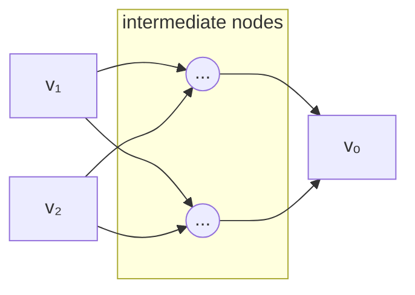

We can construct a graph for the loss function $L(\theta, x, y)$ by adding am input node $v_y$ for the label $y$ and creating a new output node $v_L$ that compares the output of $f_\theta$ (the node $v_\theta$) with $y$.

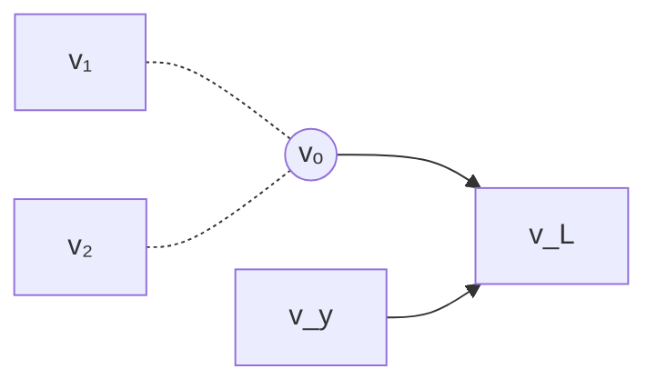
input node $v_y$ takes in the label $y$ and $f_{v_L}$ encodes the loss function, e.g., MSE 
$$
\left(\frac{\partial g}{\partial \theta_1}, \dots, \frac{\partial g}{\partial \theta_n}\right) 
\overrightarrow{\ \text{ for a particular }  \theta^0 \ }
\left(\frac{\partial g(\theta^0)}{\partial \theta_1}, \dots, \frac{\partial g(\theta^0)}{\partial \theta_n}\right) 
$$ 
***Gradient Descent:***
- Start with $j=0$ and a random value $\theta$, called $\theta^0$
- Set $\theta^{j+1}$ to $\theta^j - \eta((\nabla g)(\theta^i))$
- Set $j$ to $j+1$ and repeat 
$\eta > 0$ learning rate 

$$
\frac{1}{m} \sum^m_{i=1} \nabla L(\theta, x_i, y_i)
$$ 
Set $\theta^{j+1}$ to $\theta^j - \frac{\eta}{m} \sum^m_{i=1} \nabla L(\theta^j, x_i, y_i)$ 

***SGD/mini-batch gradient descent:***
- Start with $j=0$ and a random value $\theta$, called $\theta^0$
- Divide the dataset into a random set of $k$ batches: $B_1, B_2, \dots, B_k$
- For $i$ from 1 to $k$:
	- Set $\theta^{j+1}$ to $\theta^j - \frac{\eta}{m} \sum^m_{(x, y) \in B_i} \nabla L(\theta^j, x_i, y_i)$ 
	- Set $j$ to $j +1$
- reiterate

Size of batches $k$ is dependent on how much data can be put into the GPU at any one point.

These optimization algorithms do not provide any robustness to the networks, as we are only minimizing loss over average prediction. Not robust to perturbations, even if they are, abstract interpretation fails to provide a proof due to its overapproximate nature. So we would like to train neural networks in such a way that they are friendly to abstract interpretation. 

### Redefining Optimization Objective for Robustness
(Robustness Optimization Objective)

For every $(x, y)$ in our dataset, we want the neural net to predict $y$ on all images $z$ such that $\lVert x - z \rVert_\infty \le \epsilon$. This set can be characterized as 
$$
R(x) = \{ z | \lVert x - z \rVert_\infty \le \epsilon \}
$$ 
#### New Optimization Objective

$$
\text{arg } \underset{\theta}{\text{min}} \frac{1}{m} \sum^m_{i=1} \underset{z \in R(x_i)}{\text{max }} L(\theta, x_i, y_i)
$$ 
Instead of minimizing for the loss of $(x_i, y_i)$, we minimize loss for the worst-case perturbation of $x_i$ from the set $R(x_i)$. This is known as robust optimization problem. 
Training the neural net using such an objective is known as adversarial training (very similar in appearance to minimax or other game playing techniques).

### Solving Robust Optimization via Abstract Interpretation

$R(x)$ can be defined in interval domain precisely as it represents a set of images within an $l_\infty$ bound.
We can overapproximate the inner maximization by abstractly interpreting $L$ on the entire set $R(x_i)$. 
By virtue of the soundness of the abstract transformer $L^a$, we know:
$$
\left(\underset{z \in R(x_i)}{\text{max}} L(\theta, x_i, y_i)\right) \le u
$$ 
where $L^a(\theta, R(x_i), y_i) = [l, u]$
Therefore we can overapproximate the inner maximization by abstractly interpreting the loss function on the set $R(x_i)$ and taking the upper bound.

Thus the robust optimization objective can be rewritten as:
$$
\text{arg } \underset{\theta}{\text{min }} \frac{1}{m} \sum^m_{i=1} \text{upper bound of } L^a(\theta, R(x_i), y_i)
$$ 
instead of treating $L^a$ as an abstract transformer, we can treat it as a function taking a vector of inputs and returning upper and lower bounds, this is called flattening the abstract transformer.

**Example:**
$relu(x) = max(0, x)$

$relu^a([l, u]) = [max(0, l), max(0, u)]$

flattening the $relu^a$ to $relu^{af} : \mathbb{R}^2 \rightarrow \mathbb{R}^2$

$relu^a([l, u]) = (max(0, l), max(0, u))$ : returns a tuple of values instead of an interval.

$$
\text{arg } \underset{\theta}{\text{min }} \frac{1}{m} \sum^m_{i=1} L^{af}_u(\theta, l_{i1}, u_{i1}, \dots, l_{in}, u_{in}, y_i)
$$ 
Where $L^{af}_u$ is the only upper bound of $L^{af}$ output
$$
R(x_i) = ([l_{i1}, u_{i1}], \dots, [l_{in}, u_{in}])
$$ 
SGD can optimize for such objectives because all of the abstract transformers of the interval domain that are of interest for neural nets are differentiable almost everywhere. Some can be adapted into zonotopes also.

**Example:**
$f : \mathbb{R} \rightarrow \mathbb{R}$
$$
\begin{align*}
&f^a :& &\text{1D zonotope with m-generators} &\rightarrow& &\text{1D zonotope with m-generators}  \\
&& &\langle c_0, \ c_1, \ c_2, \ c_3, \ c_4, \ c_5, \dots, c_m \rangle  && &\langle c^\prime_0, \ c^\prime_1, \ c^\prime_2, \ c^\prime_3, \ c^\prime_4, \ c^\prime_5, \ \dots, c^\prime_m \rangle
\end{align*}
$$ 
$f^{af} : \mathbb{R}^{m+1} \rightarrow \mathbb{R}^{m+1}$

Flattening does not work for polyhedra domain, because it invokes a blackbox linear programming solver for activation functions which is not differentiable.

Neural Networks trained with abstract interpretation are:
- more robust to perturbation attacks
- verifiably robust using abstract interpretation
A Neural Network could satisfy a correctness property but we may not be able to verify the neural net using abstract domain. By incorporating abstract interpretation right into the training we guide SGD towards neural nets that are more amenable to verification. 

Note: $l_p$ robustness properties are closely related to the notion of Lipschitz continuity. For instance, a network $f : \mathbb{R}^n \rightarrow \mathbb{R}^m$ is K-Lipschitz under the $l_2$-norm if
$$
\lVert f(x) - f(y) \rVert_2 \le K \lVert x -y \rVert_2
$$ 
The smallest K satisfying the above is called the Lipschitz constant of $f$. If we can bound K, then we can prove $l_2$-robustness of $f$.