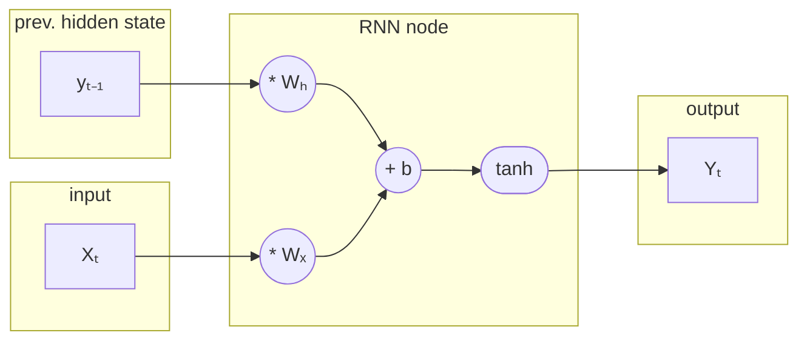
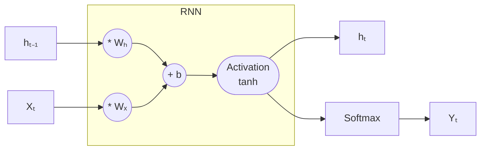
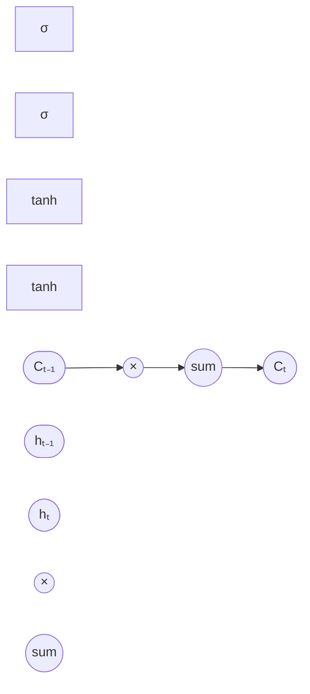

**Recurrent Neural Networks (RNNs)** have a recurring set of weights that have been trained with the help of backpropagation and utilise inputs from both the previous hidden state and current input to predict a possible output prediction.

The function representing vanilla RNNs is:
$$
y_t = a \left(W_x*X_t + W_y * y_{t-1} + b \right)
$$
where $a(\dots)$ is the activation function used and $W_x, W_y$ are the weights corresponding to the current input and previous hidden state for the single node in the Recurrent Neural Network.

There are various improvements upon this architecture such as LSTMs whose individual node structure is shown below: 

