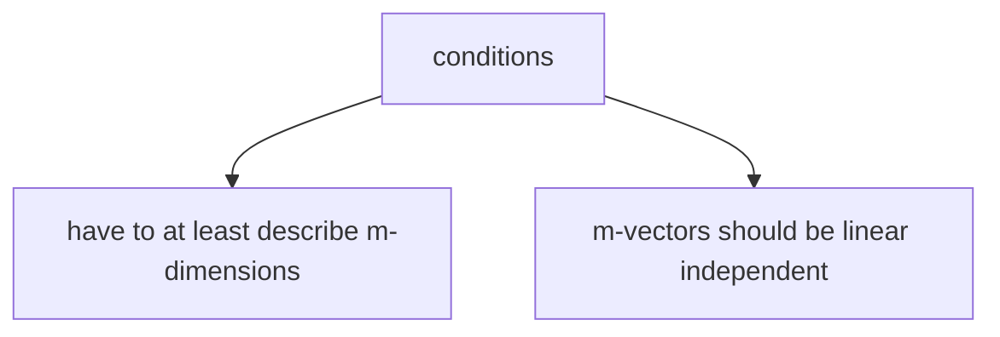

>[!info]
> Consider a set $S = \{ 1, 2, 3 \}$
> 
> $x_S$ is some subset of the set $S$, the complement of this subset can be demonstrated as $x_{-S}$.  

$$\mathsf{D} = \alpha \mathsf{B} + c \implies D_{i,j} = \alpha B_{i,j} + c$$
**Broadcasting:** 
$$\mathsf{D} = \mathsf{A} + b \implies D_{i,j} = A_{i,j} + b_j$$ 
Elements of $b$ are added to each row of the matrix $\mathsf{D}$.

Since dot product gives a scalar it is a commutative operation in the following way:
$$x^\top y = (x^\top y)^\top = y^\top x$$
###### Matrix Multiplication

$$
\begin{gather}
\mathsf{C} = \mathsf{AB} \\
C_{i,j} = \sum_k A_{i,k} B_{k,j}
\end{gather}
$$
(each element in the matrix $\mathsf{C}$ is calculated via a dot product of $i$th row of $\mathsf{A}$ and $j$th column of $\mathsf{B}$.)

If $x$ and $y$ are solutions to $\mathsf{Ax} = \mathsf{b}$, then $z = \alpha x + (1 - \alpha)y$ is also a solution for any $\alpha \in \mathbb{R}$. 

>[!info]
>A visualization for $\mathsf{Ax} = \mathsf{b}$ can be seen as:
![[matmul.png]] 
>
>$x_1$ determines how much to go in $A_{:,1}$ direction. 
>
> Therefore for each element of the resulting vector we will have $\mathsf{A} x = \sum_i x_i A_{:,i}$, where $x_i A_{:,i}$ is a scalar multiplication of $x_i$ and all elements of the $A_{:,i}$ column vector. 
> 
> The vector-matrix multiplication operation can be translated into a linear combination of the column vectors of the original matrix, multiplied with each element of the vector column:
> $$
> \alpha A_{:,1} + \beta A_{:,2} + \gamma A_{:,3}
> $$

From the above, we see that $\mathsf{b}$ will be a solution of $\mathsf{Ax} = \mathsf{b}$ only when it is in the column span (range) of $\mathsf{A}$.

![[Abasis.drawio.png]]
$\mathsf{b}$ can be thought of as being pulled $x_1$ quantity in $A_{:,1}$ direction $x_2$ times in $A_{:,2}$ direction and $x_3$ times in $A_{:,3})$ direction. We need $\mathsf{A}$ to have at least $m$ independent columns in order to define $\mathbb{R}^m$ as their column space ($n \ge m$).

if $\mathsf{A}$ is a $3 \times 2$ matrix and $\mathsf{b}$ is $3 \times 1$, $x$ is 2-dimensional, so $x$ defines only a 2-D plane within $\mathbb{R}^3$, the equation has a solution iff $\mathsf{b}$ lies on that plane. 

